# BỘ BIỂU ĐỒ BÁO CÁO CUỐI KỲ — PHẦN 1 & PHẦN 2

**Đề tài:** qEvent — Hệ thống quản trị sự kiện, soát vé động và tương tác thời gian thực theo kiến trúc microservices
**Tài liệu nguồn:** `docs/BAO_CAO_CUOI_KY_P1_P2.md` (Phần 1, Phần 2), `ARCHITECTURE.md`,
`services/*/prisma/schema.prisma`, `services/*/src/**`, `gateway/src/index.ts`

> **Nguyên tắc đối chiếu.** Mọi luồng dưới đây được vẽ từ mã nguồn đang chạy, không phải từ mô tả mong muốn.
> Khi báo cáo và mã nguồn lệch nhau, biểu đồ theo mã nguồn và chênh lệch được ghi rõ ở **mục 8**.
> Hai điểm cần nhớ trước khi đọc:
>
> - `STAFF` **không** tạo được sự kiện; chỉ `ORGANIZER` có quyền (`requireOrganizer` trong `event-service`).
> - Ở Engagement, `STAFF`, `ORGANIZER`, `HOST` đều điều khiển được phiên (`HOST_ROLES`); riêng `HOST` bị giới hạn theo `EventHost`.

## Mục lục

1. [Biểu đồ use case](#1-biểu-đồ-use-case)
2. [Biểu đồ lớp](#2-biểu-đồ-lớp)
3. [Biểu đồ hoạt động](#3-biểu-đồ-hoạt-động)
4. [Biểu đồ CSDL](#4-biểu-đồ-csdl)
5. [Biểu đồ lớp DAO](#5-biểu-đồ-lớp-dao)
6. [Biểu đồ tuần tự kèm mô tả từng bước](#6-biểu-đồ-tuần-tự-kèm-mô-tả-từng-bước)
7. [Bảng đối chiếu báo cáo ↔ biểu đồ](#7-bảng-đối-chiếu-báo-cáo--biểu-đồ)
8. [Sai lệch giữa báo cáo và mã nguồn](#8-sai-lệch-giữa-báo-cáo-và-mã-nguồn)

---

# 1. Biểu đồ use case

## 1.1. Use case của Attendee

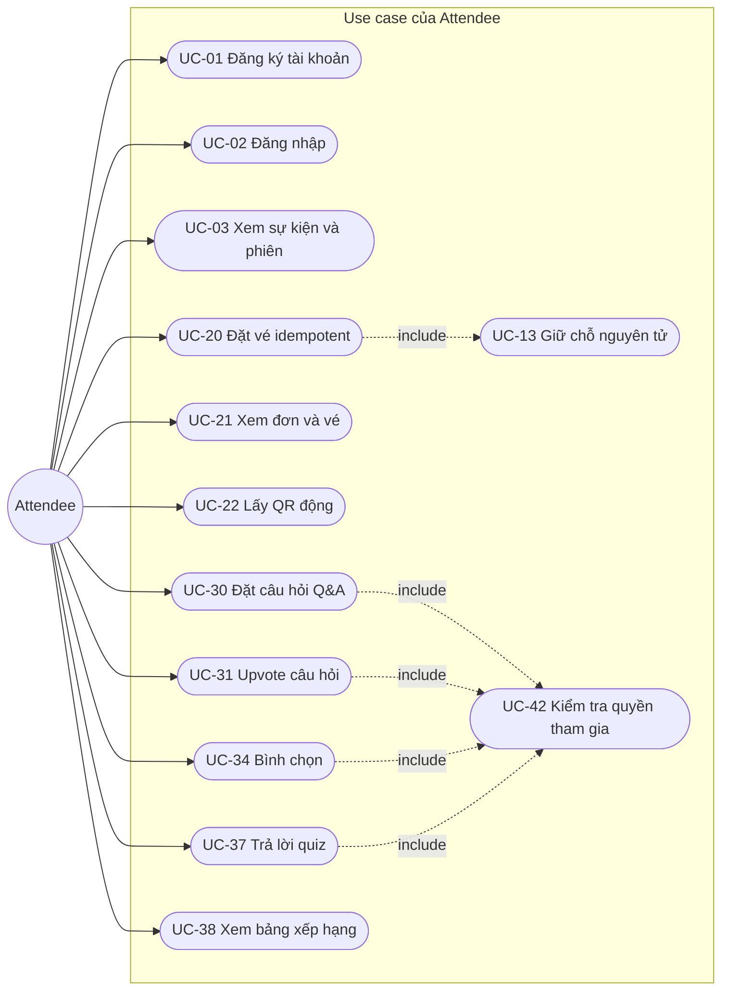
```mermaid
flowchart LR
    A(("Attendee"))

    subgraph ATT["Use case của Attendee"]
        direction TB
        U01(["UC-01 Đăng ký tài khoản"])
        U02(["UC-02 Đăng nhập"])
        U03(["UC-03 Xem sự kiện và phiên"])
        U20(["UC-20 Đặt vé idempotent"])
        U21(["UC-21 Xem đơn và vé"])
        U22(["UC-22 Lấy QR động"])
        U30(["UC-30 Đặt câu hỏi Q&A"])
        U31(["UC-31 Upvote câu hỏi"])
        U34(["UC-34 Bình chọn"])
        U37(["UC-37 Trả lời quiz"])
        U38(["UC-38 Xem bảng xếp hạng"])
        U13(["UC-13 Giữ chỗ nguyên tử"])
        U42(["UC-42 Kiểm tra quyền tham gia"])
    end

    A --> U01
    A --> U02
    A --> U03
    A --> U20
    A --> U21
    A --> U22
    A --> U30
    A --> U31
    A --> U34
    A --> U37
    A --> U38

    U20 -.->|include| U13
    U30 -.->|include| U42
    U31 -.->|include| U42
    U34 -.->|include| U42
    U37 -.->|include| U42
```

## 1.2. Use case của Staff

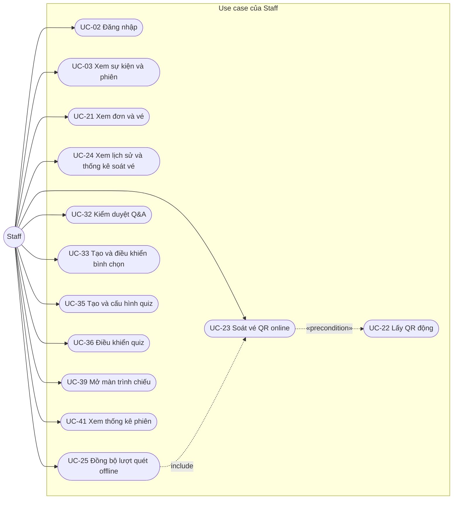
```mermaid
flowchart LR
    S(("Staff"))

    subgraph STF["Use case của Staff"]
        direction TB
        S02(["UC-02 Đăng nhập"])
        S03(["UC-03 Xem sự kiện và phiên"])
        S21(["UC-21 Xem đơn và vé"])
        S23(["UC-23 Soát vé QR online"])
        S24(["UC-24 Xem lịch sử và thống kê soát vé"])
        S25(["UC-25 Đồng bộ lượt quét offline"])
        S32(["UC-32 Kiểm duyệt Q&A"])
        S33(["UC-33 Tạo và điều khiển bình chọn"])
        S35(["UC-35 Tạo và cấu hình quiz"])
        S36(["UC-36 Điều khiển quiz"])
        S39(["UC-39 Mở màn trình chiếu"])
        S41(["UC-41 Xem thống kê phiên"])
        S22(["UC-22 Lấy QR động"])
    end

    S --> S02
    S --> S03
    S --> S21
    S --> S23
    S --> S24
    S --> S25
    S --> S32
    S --> S33
    S --> S35
    S --> S36
    S --> S39
    S --> S41

    S23 -.->|«precondition»| S22
    S25 -.->|include| S23
```

> `STAFF` điều khiển được phiên vì `HOST_ROLES` gồm `ORGANIZER`, `HOST`, `STAFF`; khác biệt duy nhất là
> `STAFF` không bị giới hạn theo `EventHost` và **không** tạo được sự kiện.

## 1.3. Use case của Host

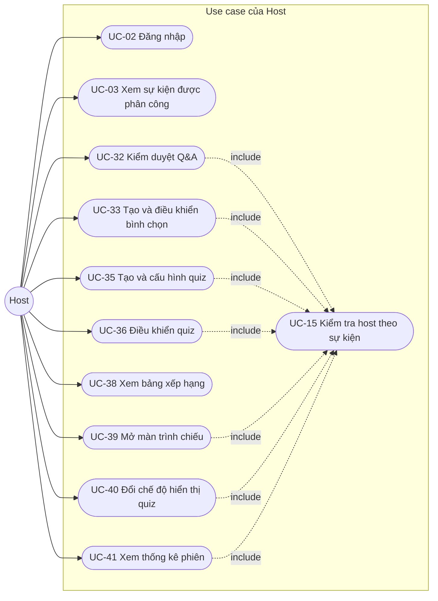
```mermaid
flowchart LR
    H(("Host"))

    subgraph HST["Use case của Host"]
        direction TB
        H02(["UC-02 Đăng nhập"])
        H03(["UC-03 Xem sự kiện được phân công"])
        H32(["UC-32 Kiểm duyệt Q&A"])
        H33(["UC-33 Tạo và điều khiển bình chọn"])
        H35(["UC-35 Tạo và cấu hình quiz"])
        H36(["UC-36 Điều khiển quiz"])
        H38(["UC-38 Xem bảng xếp hạng"])
        H39(["UC-39 Mở màn trình chiếu"])
        H40(["UC-40 Đổi chế độ hiển thị quiz"])
        H41(["UC-41 Xem thống kê phiên"])
        H15(["UC-15 Kiểm tra host theo sự kiện"])
    end

    H --> H02
    H --> H03
    H --> H32
    H --> H33
    H --> H35
    H --> H36
    H --> H38
    H --> H39
    H --> H40
    H --> H41

    H32 -.->|include| H15
    H33 -.->|include| H15
    H35 -.->|include| H15
    H36 -.->|include| H15
    H39 -.->|include| H15
    H40 -.->|include| H15
    H41 -.->|include| H15
```

> Host **không** có: quản lý sự kiện/phòng/phiên/loại vé, xem đơn, soát vé, quản lý sức chứa.
> Host vẫn tương tác như khán giả (hỏi, vote, trả lời quiz) nếu đã check-in — khi đó đi qua BR-6, không qua BR-7.

## 1.4. Use case của Organizer

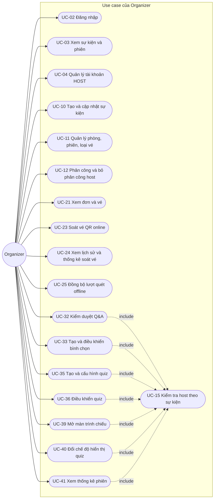
```mermaid
flowchart LR
    O(("Organizer"))

    subgraph ORG["Use case của Organizer"]
        direction TB
        O02(["UC-02 Đăng nhập"])
        O03(["UC-03 Xem sự kiện và phiên"])
        O04(["UC-04 Quản lý tài khoản HOST"])
        O10(["UC-10 Tạo và cập nhật sự kiện"])
        O11(["UC-11 Quản lý phòng, phiên, loại vé"])
        O12(["UC-12 Phân công và bỏ phân công host"])
        O21(["UC-21 Xem đơn và vé"])
        O23(["UC-23 Soát vé QR online"])
        O24(["UC-24 Xem lịch sử và thống kê soát vé"])
        O25(["UC-25 Đồng bộ lượt quét offline"])
        O32(["UC-32 Kiểm duyệt Q&A"])
        O33(["UC-33 Tạo và điều khiển bình chọn"])
        O35(["UC-35 Tạo và cấu hình quiz"])
        O36(["UC-36 Điều khiển quiz"])
        O39(["UC-39 Mở màn trình chiếu"])
        O40(["UC-40 Đổi chế độ hiển thị quiz"])
        O41(["UC-41 Xem thống kê phiên"])
        O15(["UC-15 Kiểm tra host theo sự kiện"])
    end

    O --> O02
    O --> O03
    O --> O04
    O --> O10
    O --> O11
    O --> O12
    O --> O21
    O --> O23
    O --> O24
    O --> O25
    O --> O32
    O --> O33
    O --> O35
    O --> O36
    O --> O39
    O --> O40
    O --> O41

    O32 -.->|include| O15
    O33 -.->|include| O15
    O35 -.->|include| O15
    O36 -.->|include| O15
    O39 -.->|include| O15
    O40 -.->|include| O15
    O41 -.->|include| O15
```

> Organizer là vai trò **duy nhất** tạo/sửa sự kiện và phân công host. Organizer cũng giữ toàn bộ quyền
> vận hành của Staff (soát vé, xem đơn, điều khiển phiên).

## 1.5. Use case nội bộ giữa các service

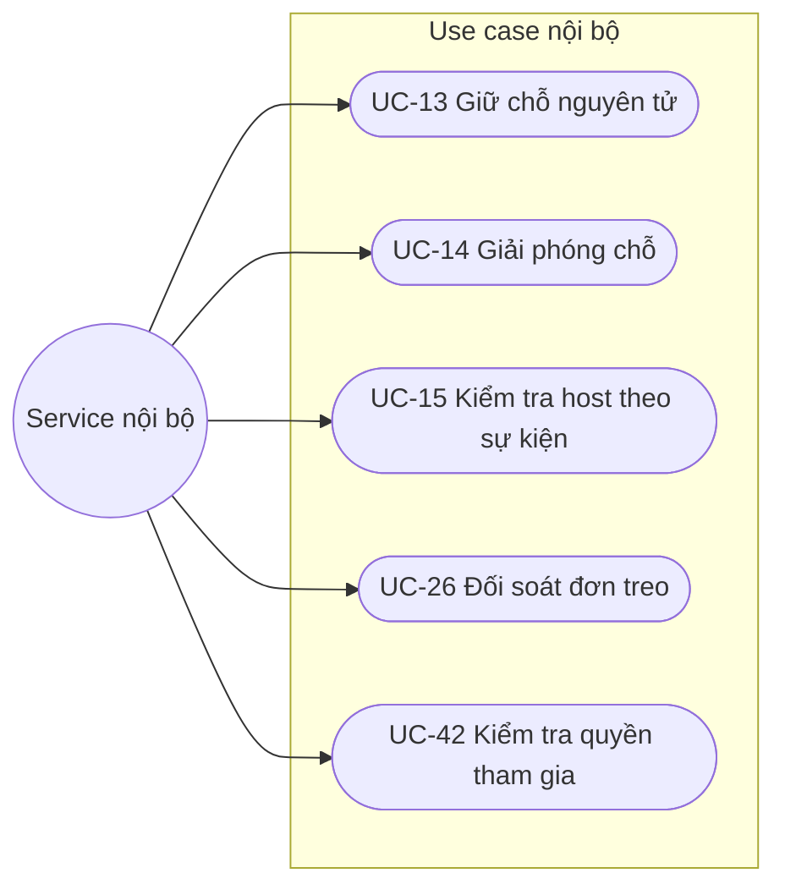
```mermaid
flowchart LR
    SVC(("Service nội bộ"))

    subgraph INTERNAL["Use case nội bộ"]
        direction TB
        I13(["UC-13 Giữ chỗ nguyên tử"])
        I14(["UC-14 Giải phóng chỗ"])
        I15(["UC-15 Kiểm tra host theo sự kiện"])
        I26(["UC-26 Đối soát đơn treo"])
        I42(["UC-42 Kiểm tra quyền tham gia"])
    end

    SVC --> I13
    SVC --> I14
    SVC --> I15
    SVC --> I26
    SVC --> I42
```

> Các use case này không lộ ra ngoài: chỉ gọi được khi có `x-service-token` (Event, Admission) hoặc do worker
> nội bộ chạy định kỳ (đối soát). Đây là các "use case hệ thống" của kiến trúc microservices.

## 1.6. Quan hệ include / extend

| Use case | Quan hệ | Use case đích | Ý nghĩa |
|---|---|---|---|
| UC-20 Đặt vé | `include` | UC-13 Giữ chỗ | Đơn chỉ được xác nhận sau khi Event Service giữ chỗ thành công |
| UC-20 Đặt vé | `extend` | UC-26 Đối soát | Chỉ khi lỗi hạ tầng/không rõ kết quả, đơn chuyển `PENDING_RECONCILIATION` và worker đối soát |
| UC-23 Soát vé | `precondition` | UC-22 QR động | Token QR phải được sinh và ký trước khi quét; đây là tiền điều kiện, không phải include |
| UC-25 Đồng bộ offline | `include` | UC-23 Soát vé | Dùng cùng luật chấp nhận `PAID → CHECKED_IN`, khác nguồn `isOffline` |
| UC-30, 31, 34, 37 | `include` | UC-42 Kiểm tra quyền tham gia | BR-6: phải check-in đúng sự kiện và phiên đang `isLive` |
| UC-32, 33, 35, 36, 39, 40, 41 | `include` | UC-15 Kiểm tra host theo sự kiện | BR-7: chỉ áp dụng cho tài khoản `HOST`; `STAFF`/`ORGANIZER` toàn cục |
| UC-25 Đồng bộ offline | `extend` | UC-23 Soát vé | Chỉ xảy ra khi cổng mất mạng |

## 1.7. Ma trận quyền theo vai trò

| Use case | ATTENDEE | STAFF | HOST | ORGANIZER |
|---|---|---|---|---|
| UC-01 Đăng ký | ✅ | — | — | — |
| UC-02 Đăng nhập | ✅ | ✅ | ✅ | ✅ |
| UC-03 Xem sự kiện | ✅ | ✅ | ✅ (chỉ sự kiện được gán) | ✅ |
| UC-04 Quản lý tài khoản HOST | — | — | — | ✅ |
| UC-10 Tạo/cập nhật sự kiện | — | ❌ `403 FORBIDDEN` | ❌ | ✅ |
| UC-11 Phòng/phiên/loại vé | — | — | — | ✅ |
| UC-12 Phân công host | — | — | — | ✅ |
| UC-20 Đặt vé | ✅ | ✅ | ✅ | ✅ |
| UC-21 Xem đơn/vé | ✅ (chỉ của mình) | ✅ (mọi đơn) | ❌ (trừ đơn của chính mình) | ✅ |
| UC-22 Lấy QR động | ✅ (vé của mình) | ✅ | ✅ | ✅ |
| UC-23 Soát vé | — | ✅ | ❌ | ✅ |
| UC-24 Lịch sử/thống kê soát vé | — | ✅ | ❌ | ✅ |
| UC-25 Đồng bộ offline | — | ✅ | ❌ | ✅ |
| UC-30/31 Q&A, upvote | ✅ (đã check-in) | ✅ (đã check-in) | ✅ (đã check-in) | ✅ (đã check-in) |
| UC-32 Kiểm duyệt Q&A | — | ✅ | ✅ (sự kiện được gán) | ✅ |
| UC-33/34 Bình chọn | ✅ (đã check-in) | ✅ (điều khiển; vote cần check-in) | ✅ (điều khiển; vote cần check-in) | ✅ (vote cần check-in) |
| UC-35/36 Quiz | — | ✅ | ✅ (sự kiện được gán) | ✅ |
| UC-37 Trả lời quiz | ✅ (đã check-in) | ✅ (đã check-in) | ✅ (đã check-in) | ✅ (đã check-in) |
| UC-38 Bảng xếp hạng | ✅ (đọc qua API) | ✅ | ✅ | ✅ |
| UC-39 Màn trình chiếu | — | ✅ | ✅ (sự kiện được gán) | ✅ |
| UC-40 Chế độ hiển thị quiz | — | ✅ | ✅ | ✅ |
| UC-41 Thống kê phiên | — | ✅ | ✅ | ✅ |

> Ghi chú hiện thực: `isHostRole()` trong Engagement trả `true` cho cả `STAFF`, `ORGANIZER`, `HOST`;
> chỉ `HOST` đi qua `requireHostSession()`. Vì vậy cột `STAFF`/`ORGANIZER` là toàn cục, cột `HOST` bị chặn bởi `EventHost`.

## 1.8. Đặc tả use case chính

| Mã | Tác nhân | Tiền điều kiện | Luồng chính | Ngoại lệ |
|---|---|---|---|---|
| UC-20 | Attendee | Đã đăng nhập; có `Idempotency-Key` | Kiểm tra idempotency → tạo đơn `PENDING` → giữ chỗ → cấp vé `PAID` → `201` | `400` thiếu key; `409 IDEMPOTENCY_CONFLICT`; `409 SOLD_OUT`; `202` khi lỗi hạ tầng |
| UC-22 | Attendee | Vé tồn tại, đơn `CONFIRMED`, vé không `CANCELLED` | Sinh TOTP từ `qrSecret` → ký RSA-SHA256 → trả token + `expiresIn` | `404 TICKET_NOT_FOUND`; `403 FORBIDDEN`; `409 TICKET_CANCELLED`; `409 ORDER_NOT_CONFIRMED` |
| UC-23 | Staff/Organizer | Có token QR còn hạn | Xác thực chữ ký → kiểm tra tuổi token → kiểm tra TOTP → CAS `PAID → CHECKED_IN` → ghi log | `400 INVALID_QR_TOKEN`; `409 ALREADY_CHECKED_IN`; `409 ORDER_NOT_CONFIRMED` |
| UC-25 | Staff/Organizer | Có hàng đợi cục bộ | Sắp xếp theo `scannedAt` → chống trùng `scanKey` → CAS từng vé → phân loại `SYNCED/CONFLICT/DUPLICATE/ERROR` | `400` nếu `logs` rỗng; lỗi từng bản ghi nằm trong `results` |
| UC-30 | Attendee | Đã check-in, phiên `isLive` | Kiểm tra BR-6 → tạo câu hỏi → phát WebSocket `NEW_QUESTION` → `201` | `403 NOT_CHECKED_IN`; `403 SESSION_NOT_LIVE`; `503/504` khi service chéo lỗi |
| UC-34 | Attendee | Poll đang mở, đã check-in | Chưa vote → ghi phiếu; vote lại cùng option → hủy phiếu; option khác → chuyển phiếu | `400 POLL_INACTIVE`; `400 INVALID_OPTION`; `403 NOT_CHECKED_IN` |
| UC-36 | Staff/Organizer/Host | Game tồn tại, đúng trạng thái | `start → QUESTION_ACTIVE → ROUND_REVEALED → next … → FINISHED` | `409 INVALID_GAME_STATE`; `400 NO_QUESTIONS`; `409 NO_MORE_QUESTIONS` |
| UC-39 | Staff/Organizer/Host | Có phiên được phân công | Tải dữ liệu phiên → mở WebSocket → hiển thị 5 loại slide → điều khiển tại chỗ | Mất socket → chuyển polling; `403 EVENT_NOT_ASSIGNED` với HOST |

---

# 2. Biểu đồ lớp

## 2.0. Ghi chú về phương thức trong biểu đồ lớp

Các lớp ở mục 2.1–2.3 mô hình hoá **trạng thái và hành vi nghiệp vụ** của thực thể. Trong mã nguồn,
hành vi được cài trong các hàm service (`event.service.ts`, `order.service.ts`, `checkin.service.ts`,
`qa/poll/game.routes.ts`) chứ không phải method của lớp Prisma. Ánh xạ hiện thực nằm ở mục 5.

## 2.1. Miền Sự kiện & sức chứa (`event-service`)

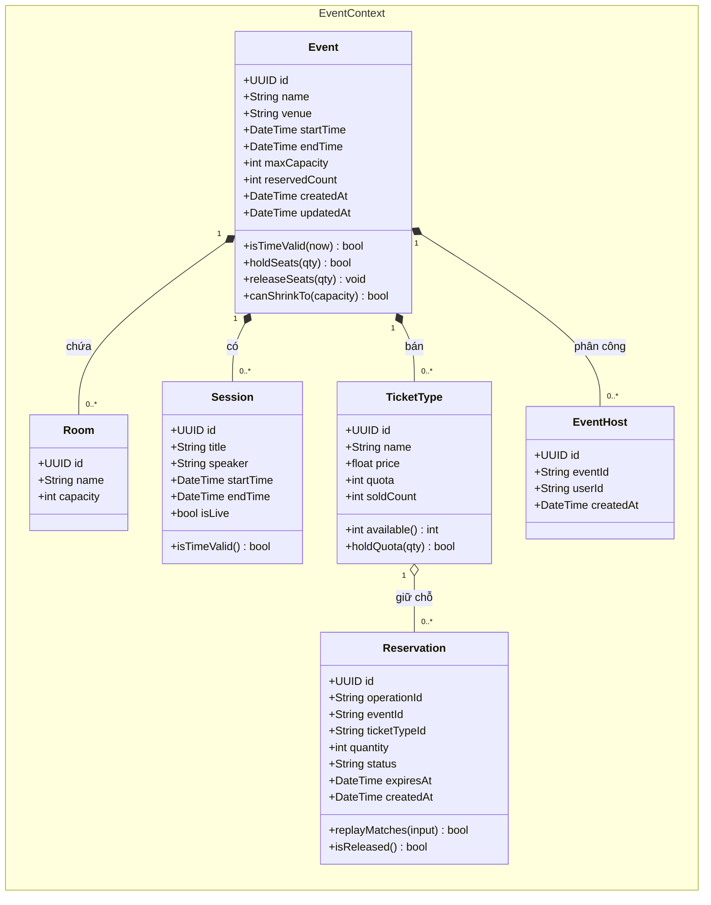
```mermaid
classDiagram
    direction LR

    namespace EventContext {
        class Event {
            +UUID id
            +String name
            +String venue
            +DateTime startTime
            +DateTime endTime
            +int maxCapacity
            +int reservedCount
            +DateTime createdAt
            +DateTime updatedAt
            +isTimeValid(now) bool
            +holdSeats(qty) bool
            +releaseSeats(qty) void
            +canShrinkTo(capacity) bool
        }

        class Room {
            +UUID id
            +String name
            +int capacity
        }

        class Session {
            +UUID id
            +String title
            +String speaker
            +DateTime startTime
            +DateTime endTime
            +bool isLive
            +isTimeValid() bool
        }

        class TicketType {
            +UUID id
            +String name
            +float price
            +int quota
            +int soldCount
            +int available() int
            +holdQuota(qty) bool
        }

        class Reservation {
            +UUID id
            +String operationId
            +String eventId
            +String ticketTypeId
            +int quantity
            +String status
            +DateTime expiresAt
            +DateTime createdAt
            +replayMatches(input) bool
            +isReleased() bool
        }

        class EventHost {
            +UUID id
            +String eventId
            +String userId
            +DateTime createdAt
        }
    }

    Event "1" *-- "0..*" Room : chứa
    Event "1" *-- "0..*" Session : có
    Event "1" *-- "0..*" TicketType : bán
    Event "1" *-- "0..*" EventHost : phân công
    TicketType "1" o-- "0..*" Reservation : giữ chỗ
```

**Ràng buộc trên lớp**

| Lớp | Bất biến | Nơi kiểm tra |
|---|---|---|
| `Event` | `startTime < endTime` và `startTime >= now` khi tạo/đổi giờ bắt đầu | `createEvent`, `updateEvent` → `422 INVALID_EVENT_TIME` |
| `Event` | `reservedCount <= maxCapacity` tại mọi thời điểm | `UPDATE ... WHERE reservedCount + qty <= maxCapacity` |
| `Event` | Không hạ `maxCapacity` dưới `reservedCount` | `UPDATE ... WHERE reservedCount <= maxCapacity` → `409 CAPACITY_BELOW_RESERVED` |
| `TicketType` | `soldCount <= quota` | `UPDATE ... WHERE soldCount + qty <= quota` → `409 SOLD_OUT` |
| `TicketType` | Không hạ `quota` dưới `soldCount` | `updateTicketType` → `409 QUOTA_BELOW_SOLD` |
| `Session` | `startTime < endTime` | `422 INVALID_SESSION_TIME` |
| `Reservation` | `operationId` duy nhất; `RELEASED` không tái sử dụng | unique index + `replay()` → `409 RESERVATION_RELEASED` |
| `EventHost` | Duy nhất cặp `(eventId, userId)` | `@@unique([eventId, userId])` |

## 2.2. Miền Vé & soát vé (`admission-service`)

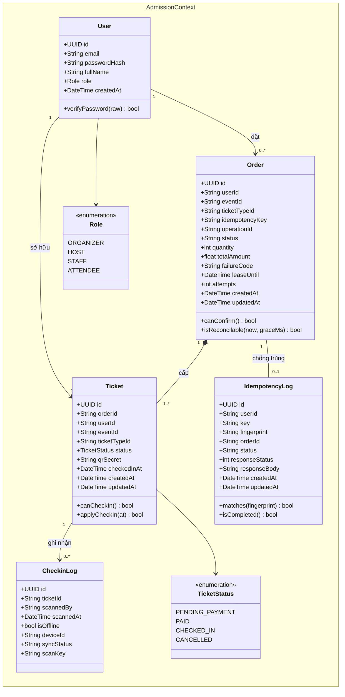
```mermaid
classDiagram
    direction LR

    namespace AdmissionContext {
        class User {
            +UUID id
            +String email
            +String passwordHash
            +String fullName
            +Role role
            +DateTime createdAt
            +verifyPassword(raw) bool
        }

        class Order {
            +UUID id
            +String userId
            +String eventId
            +String ticketTypeId
            +String idempotencyKey
            +String operationId
            +String status
            +int quantity
            +float totalAmount
            +String failureCode
            +DateTime leaseUntil
            +int attempts
            +DateTime createdAt
            +DateTime updatedAt
            +canConfirm() bool
            +isReconcilable(now, graceMs) bool
        }

        class IdempotencyLog {
            +UUID id
            +String userId
            +String key
            +String fingerprint
            +String orderId
            +String status
            +int responseStatus
            +String responseBody
            +DateTime createdAt
            +DateTime updatedAt
            +matches(fingerprint) bool
            +isCompleted() bool
        }

        class Ticket {
            +UUID id
            +String orderId
            +String userId
            +String eventId
            +String ticketTypeId
            +TicketStatus status
            +String qrSecret
            +DateTime checkedInAt
            +DateTime createdAt
            +DateTime updatedAt
            +canCheckIn() bool
            +applyCheckIn(at) bool
        }

        class CheckinLog {
            +UUID id
            +String ticketId
            +String scannedBy
            +DateTime scannedAt
            +bool isOffline
            +String deviceId
            +String syncStatus
            +String scanKey
        }

        class Role {
            <<enumeration>>
            ORGANIZER
            HOST
            STAFF
            ATTENDEE
        }

        class TicketStatus {
            <<enumeration>>
            PENDING_PAYMENT
            PAID
            CHECKED_IN
            CANCELLED
        }
    }

    User "1" --> "0..*" Order : đặt
    User "1" --> "0..*" Ticket : sở hữu
    Order "1" *-- "1..*" Ticket : cấp
    Order "1" -- "0..1" IdempotencyLog : chống trùng
    Ticket "1" --> "0..*" CheckinLog : ghi nhận
    User --> Role
    Ticket --> TicketStatus
```

**Trạng thái `Order`** (`status` là `String`, không phải enum Prisma):

`PENDING → CONFIRMED | FAILED | PENDING_RECONCILIATION → COMPENSATING → FAILED`

**Trạng thái `Ticket`**: `PENDING_PAYMENT → PAID → CHECKED_IN`, nhánh `CANCELLED`. Trong luồng hiện tại vé được tạo thẳng `PAID`.

## 2.3. Miền Tương tác trong phiên (`engagement-service`)

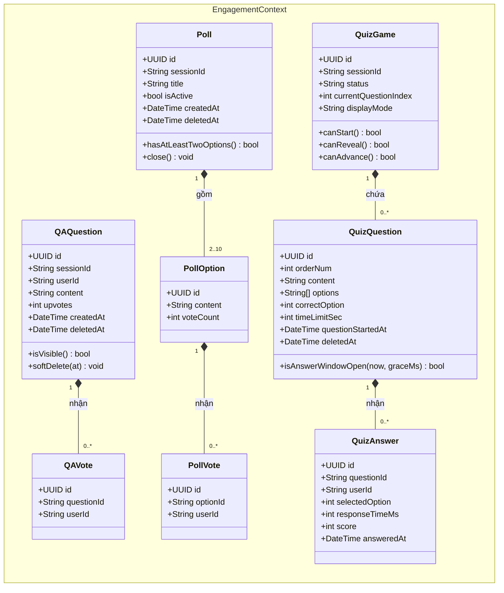
```mermaid
classDiagram
    direction LR

    namespace EngagementContext {
        class QAQuestion {
            +UUID id
            +String sessionId
            +String userId
            +String content
            +int upvotes
            +DateTime createdAt
            +DateTime deletedAt
            +isVisible() bool
            +softDelete(at) void
        }

        class QAVote {
            +UUID id
            +String questionId
            +String userId
        }

        class Poll {
            +UUID id
            +String sessionId
            +String title
            +bool isActive
            +DateTime createdAt
            +DateTime deletedAt
            +hasAtLeastTwoOptions() bool
            +close() void
        }

        class PollOption {
            +UUID id
            +String content
            +int voteCount
        }

        class PollVote {
            +UUID id
            +String optionId
            +String userId
        }

        class QuizGame {
            +UUID id
            +String sessionId
            +String status
            +int currentQuestionIndex
            +String displayMode
            +canStart() bool
            +canReveal() bool
            +canAdvance() bool
        }

        class QuizQuestion {
            +UUID id
            +int orderNum
            +String content
            +String[] options
            +int correctOption
            +int timeLimitSec
            +DateTime questionStartedAt
            +DateTime deletedAt
            +isAnswerWindowOpen(now, graceMs) bool
        }

        class QuizAnswer {
            +UUID id
            +String questionId
            +String userId
            +int selectedOption
            +int responseTimeMs
            +int score
            +DateTime answeredAt
        }
    }

    QAQuestion "1" *-- "0..*" QAVote : nhận
    Poll "1" *-- "2..10" PollOption : gồm
    PollOption "1" *-- "0..*" PollVote : nhận
    QuizGame "1" *-- "0..*" QuizQuestion : chứa
    QuizQuestion "1" *-- "0..*" QuizAnswer : nhận
```

**Trạng thái `QuizGame`**: `WAITING → QUESTION_ACTIVE → ROUND_REVEALED → … → FINISHED`, và `FINISHED | ROUND_REVEALED → WAITING` khi restart.

**Công thức điểm** (`calculateQuizScore`):

```text
score = 0                                        nếu sai
score = round(1000 × (1 − t / (2 × timeLimitMs))) nếu đúng
t     = min(max(elapsed, 0), timeLimitMs)         thời gian server đo
```

## 2.4. Ba miền và tham chiếu xuyên service

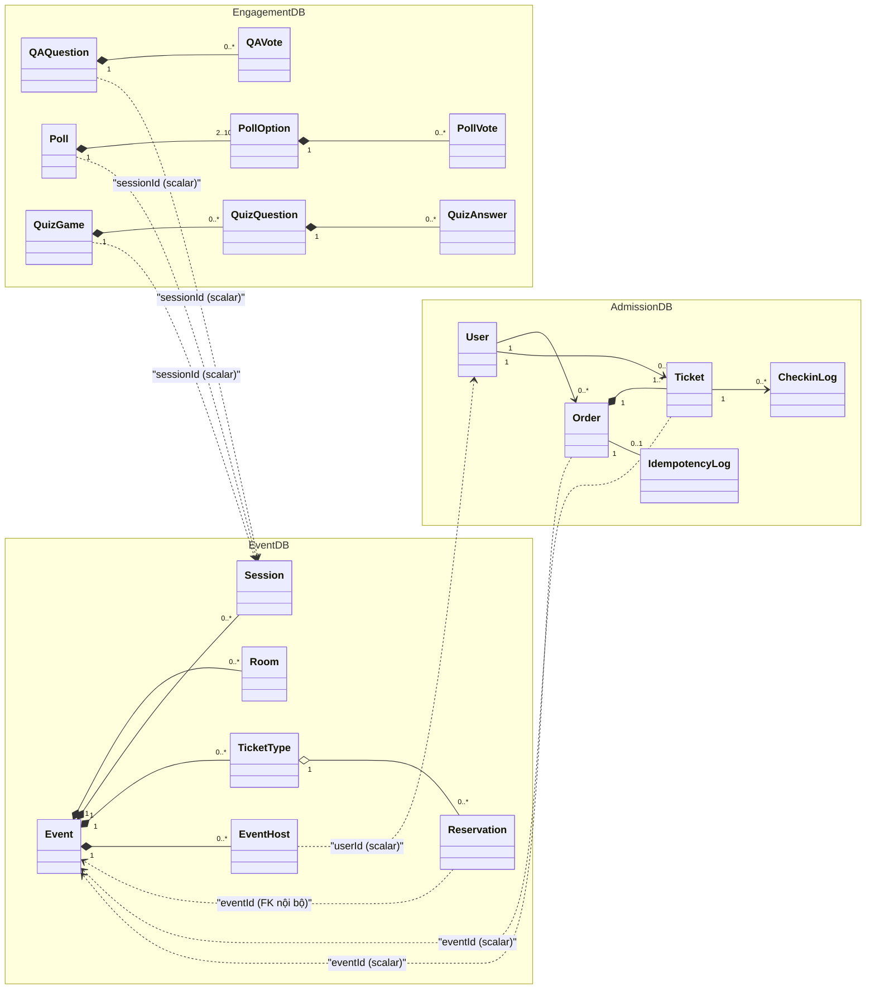
```mermaid
classDiagram
    direction LR

    namespace EventDB {
        class Event
        class Room
        class Session
        class TicketType
        class Reservation
        class EventHost
    }

    namespace AdmissionDB {
        class User
        class Order
        class IdempotencyLog
        class Ticket
        class CheckinLog
    }

    namespace EngagementDB {
        class QAQuestion
        class QAVote
        class Poll
        class PollOption
        class PollVote
        class QuizGame
        class QuizQuestion
        class QuizAnswer
    }

    Event "1" *-- "0..*" Room
    Event "1" *-- "0..*" Session
    Event "1" *-- "0..*" TicketType
    Event "1" *-- "0..*" EventHost
    TicketType "1" o-- "0..*" Reservation

    User "1" --> "0..*" Order
    User "1" --> "0..*" Ticket
    Order "1" *-- "1..*" Ticket
    Order "1" -- "0..1" IdempotencyLog
    Ticket "1" --> "0..*" CheckinLog

    QAQuestion "1" *-- "0..*" QAVote
    Poll "1" *-- "2..10" PollOption
    PollOption "1" *-- "0..*" PollVote
    QuizGame "1" *-- "0..*" QuizQuestion
    QuizQuestion "1" *-- "0..*" QuizAnswer

    Order ..> Event : "eventId (scalar)"
    Ticket ..> Event : "eventId (scalar)"
    Reservation ..> Event : "eventId (FK nội bộ)"
    EventHost ..> User : "userId (scalar)"
    QAQuestion ..> Session : "sessionId (scalar)"
    Poll ..> Session : "sessionId (scalar)"
    QuizGame ..> Session : "sessionId (scalar)"
```

> Ba khối trên nằm ở **ba database vật lý khác nhau**. Các đường nét đứt là **tham chiếu scalar**, không có
> foreign key và không join được. Đây chính là lý do phải có saga, gọi HTTP nội bộ và đối soát.

---

# 3. Biểu đồ hoạt động

## 3.1. Tạo và cấu hình sự kiện (Organizer)

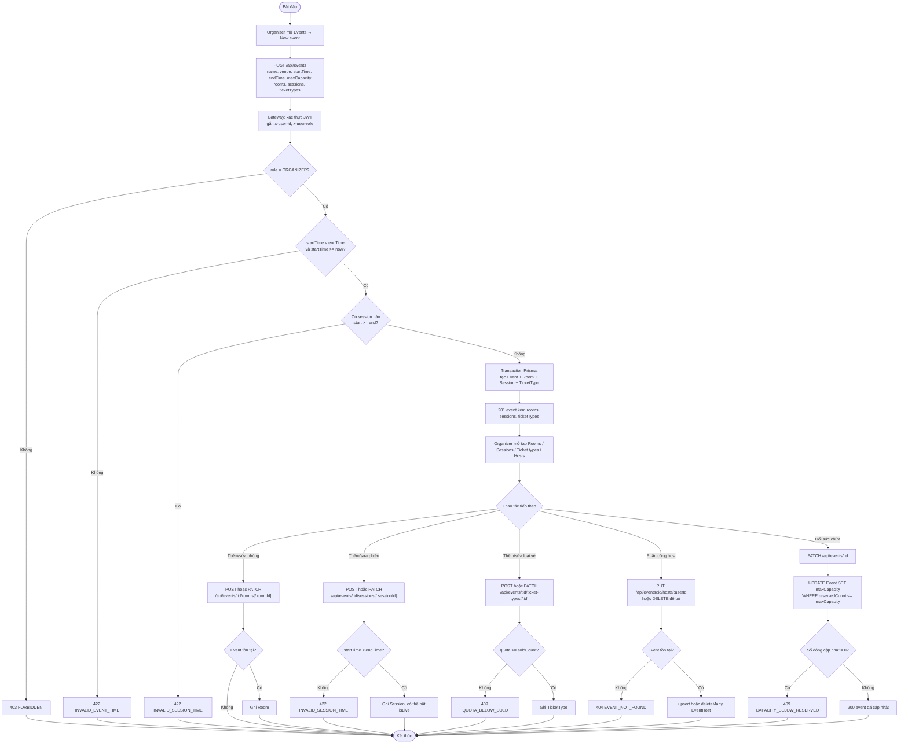
```mermaid
flowchart TD
    S([Bắt đầu]) --> A["Organizer mở Events → New event"]
    A --> B["POST /api/events<br/>name, venue, startTime, endTime, maxCapacity<br/>rooms, sessions, ticketTypes"]
    B --> C["Gateway: xác thực JWT<br/>gắn x-user-id, x-user-role"]
    C --> D{"role = ORGANIZER?"}
    D -- Không --> D1["403 FORBIDDEN"] --> Z([Kết thúc])
    D -- Có --> E{"startTime < endTime<br/>và startTime >= now?"}
    E -- Không --> E1["422 INVALID_EVENT_TIME"] --> Z
    E -- Có --> F{"Có session nào<br/>start >= end?"}
    F -- Có --> F1["422 INVALID_SESSION_TIME"] --> Z
    F -- Không --> G["Transaction Prisma:<br/>tạo Event + Room + Session + TicketType"]
    G --> H["201 event kèm rooms, sessions, ticketTypes"]
    H --> I["Organizer mở tab Rooms / Sessions / Ticket types / Hosts"]
    I --> J{"Thao tác tiếp theo"}
    J -- "Thêm/sửa phòng" --> K["POST hoặc PATCH<br/>/api/events/:id/rooms[/:roomId]"]
    J -- "Thêm/sửa phiên" --> L["POST hoặc PATCH<br/>/api/events/:id/sessions[/:sessionId]"]
    J -- "Thêm/sửa loại vé" --> M["POST hoặc PATCH<br/>/api/events/:id/ticket-types[/:id]"]
    J -- "Phân công host" --> N["PUT /api/events/:id/hosts/:userId<br/>hoặc DELETE để bỏ"]
    J -- "Đổi sức chứa" --> O["PATCH /api/events/:id"]
    K --> K1{"Event tồn tại?"}
    K1 -- Không --> Z
    K1 -- Có --> K2["Ghi Room"] --> Z
    L --> L1{"startTime < endTime?"}
    L1 -- Không --> L2["422 INVALID_SESSION_TIME"] --> Z
    L1 -- Có --> L3["Ghi Session, có thể bật isLive"] --> Z
    M --> M1{"quota >= soldCount?"}
    M1 -- Không --> M2["409 QUOTA_BELOW_SOLD"] --> Z
    M1 -- Có --> M3["Ghi TicketType"] --> Z
    N --> N1{"Event tồn tại?"}
    N1 -- Không --> N2["404 EVENT_NOT_FOUND"] --> Z
    N1 -- Có --> N3["upsert hoặc deleteMany EventHost"] --> Z
    O --> O1["UPDATE Event SET maxCapacity<br/>WHERE reservedCount <= maxCapacity"]
    O1 --> O2{"Số dòng cập nhật = 0?"}
    O2 -- Có --> O3["409 CAPACITY_BELOW_RESERVED"] --> Z
    O2 -- Không --> O4["200 event đã cập nhật"] --> Z
```

## 3.2. Đặt vé — saga ở Admission Service

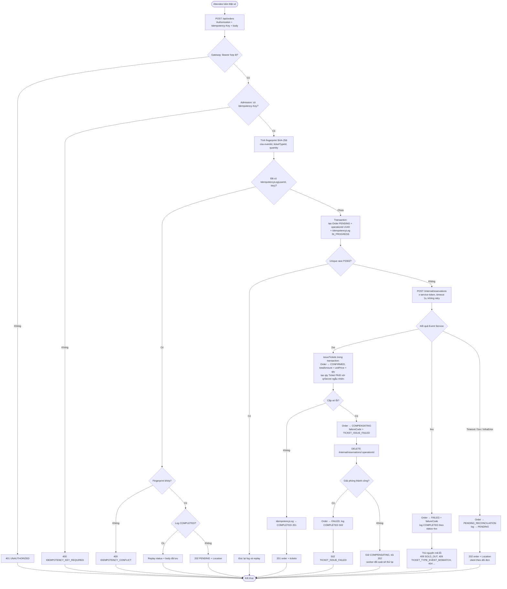
```mermaid
flowchart TD
    S([Attendee bấm Đặt vé]) --> A["POST /api/orders<br/>Authorization + Idempotency-Key + body"]
    A --> B{"Gateway: Bearer hợp lệ?"}
    B -- Không --> B1["401 UNAUTHORIZED"] --> Z([Kết thúc])
    B -- Có --> C{"Admission: có Idempotency-Key?"}
    C -- Không --> C1["400 IDEMPOTENCY_KEY_REQUIRED"] --> Z
    C -- Có --> D["Tính fingerprint SHA-256<br/>của eventId, ticketTypeId, quantity"]
    D --> E{"Đã có IdempotencyLog(userId, key)?"}
    E -- Có --> E1{"Fingerprint khớp?"}
    E1 -- Không --> E2["409 IDEMPOTENCY_CONFLICT"] --> Z
    E1 -- Có --> E3{"Log COMPLETED?"}
    E3 -- Có --> E4["Replay status + body đã lưu"] --> Z
    E3 -- Không --> E5["202 PENDING + Location"] --> Z
    E -- Chưa --> F["Transaction:<br/>tạo Order PENDING + operationId UUID<br/>+ IdempotencyLog IN_PROGRESS"]
    F --> G{"Unique race P2002?"}
    G -- Có --> G1["Đọc lại log và replay"] --> Z
    G -- Không --> H["POST /internal/reservations<br/>x-service-token, timeout 1s, không retry"]
    H --> I{"Kết quả Event Service"}
    I -- "2xx" --> J["issueTickets trong transaction:<br/>Order → CONFIRMED, totalAmount = unitPrice × qty<br/>tạo qty Ticket PAID với qrSecret ngẫu nhiên"]
    J --> J1{"Cấp vé lỗi?"}
    J1 -- Không --> K["IdempotencyLog → COMPLETED 201"] --> K1["201 order + tickets"] --> Z
    J1 -- Có --> L["Order → COMPENSATING<br/>failureCode = TICKET_ISSUE_FAILED"]
    L --> M["DELETE /internal/reservations/:operationId"]
    M --> M1{"Giải phóng thành công?"}
    M1 -- Có --> M2["Order → FAILED, log COMPLETED 502"] --> M3["502 TICKET_ISSUE_FAILED"] --> Z
    M1 -- Không --> M4["Giữ COMPENSATING, trả 202<br/>worker đối soát sẽ thử lại"] --> Z
    I -- "4xx" --> N["Order → FAILED + failureCode<br/>log COMPLETED theo status 4xx"]
    N --> N1["Trả nguyên mã lỗi<br/>409 SOLD_OUT, 409 TICKET_TYPE_EVENT_MISMATCH, 404 ..."] --> Z
    I -- "Timeout / 5xx / InfraError" --> O["Order → PENDING_RECONCILIATION<br/>log → PENDING"]
    O --> O1["202 order + Location<br/>client theo dõi đơn"] --> Z
```

**Chi tiết giữ chỗ bên Event Service**

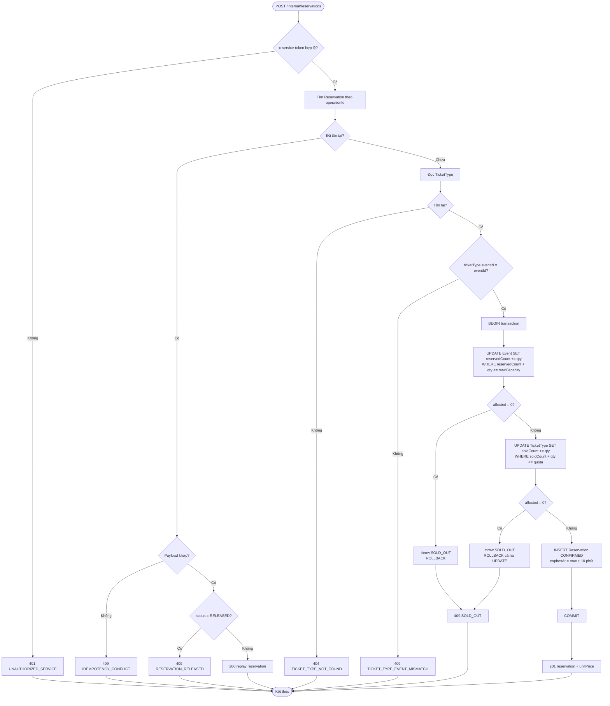
```mermaid
flowchart TD
    S([POST /internal/reservations]) --> A{"x-service-token hợp lệ?"}
    A -- Không --> A1["401 UNAUTHORIZED_SERVICE"] --> Z([Kết thúc])
    A -- Có --> B["Tìm Reservation theo operationId"]
    B --> C{"Đã tồn tại?"}
    C -- Có --> C1{"Payload khớp?"}
    C1 -- Không --> C2["409 IDEMPOTENCY_CONFLICT"] --> Z
    C1 -- Có --> C3{"status = RELEASED?"}
    C3 -- Có --> C4["409 RESERVATION_RELEASED"] --> Z
    C3 -- Không --> C5["200 replay reservation"] --> Z
    C -- Chưa --> D["Đọc TicketType"]
    D --> E{"Tồn tại?"}
    E -- Không --> E1["404 TICKET_TYPE_NOT_FOUND"] --> Z
    E -- Có --> F{"ticketType.eventId = eventId?"}
    F -- Không --> F1["409 TICKET_TYPE_EVENT_MISMATCH"] --> Z
    F -- Có --> G["BEGIN transaction"]
    G --> H["UPDATE Event SET reservedCount += qty<br/>WHERE reservedCount + qty <= maxCapacity"]
    H --> I{"affected = 0?"}
    I -- Có --> I1["throw SOLD_OUT<br/>ROLLBACK"] --> I2["409 SOLD_OUT"] --> Z
    I -- Không --> J["UPDATE TicketType SET soldCount += qty<br/>WHERE soldCount + qty <= quota"]
    J --> K{"affected = 0?"}
    K -- Có --> K1["throw SOLD_OUT<br/>ROLLBACK cả hai UPDATE"] --> I2
    K -- Không --> L["INSERT Reservation CONFIRMED<br/>expiresAt = now + 10 phút"]
    L --> M["COMMIT"]
    M --> N["201 reservation + unitPrice"] --> Z
```

## 3.3. Đối soát đơn treo (worker định kỳ)

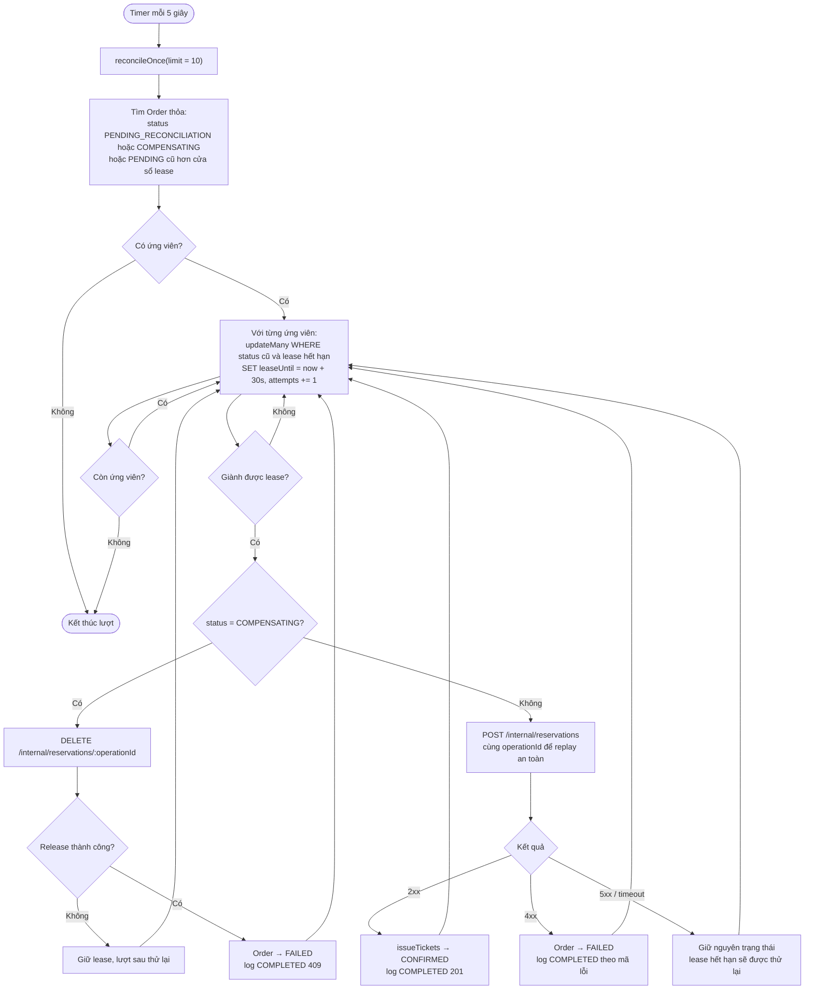
```mermaid
flowchart TD
    S([Timer mỗi 5 giây]) --> A["reconcileOnce(limit = 10)"]
    A --> B["Tìm Order thỏa:<br/>status PENDING_RECONCILIATION hoặc COMPENSATING<br/>hoặc PENDING cũ hơn cửa sổ lease"]
    B --> C{"Có ứng viên?"}
    C -- Không --> Z([Kết thúc lượt])
    C -- Có --> D["Với từng ứng viên:<br/>updateMany WHERE status cũ và lease hết hạn<br/>SET leaseUntil = now + 30s, attempts += 1"]
    D --> E{"Giành được lease?"}
    E -- Không --> D
    E -- Có --> F{"status = COMPENSATING?"}
    F -- Có --> G["DELETE /internal/reservations/:operationId"]
    G --> H{"Release thành công?"}
    H -- Không --> H1["Giữ lease, lượt sau thử lại"] --> D
    H -- Có --> H2["Order → FAILED<br/>log COMPLETED 409"]
    H2 --> D
    F -- Không --> I["POST /internal/reservations<br/>cùng operationId để replay an toàn"]
    I --> J{"Kết quả"}
    J -- "2xx" --> K["issueTickets → CONFIRMED<br/>log COMPLETED 201"] --> D
    J -- "4xx" --> L["Order → FAILED<br/>log COMPLETED theo mã lỗi"] --> D
    J -- "5xx / timeout" --> M["Giữ nguyên trạng thái<br/>lease hết hạn sẽ được thử lại"] --> D
    D --> N{"Còn ứng viên?"}
    N -- Có --> D
    N -- Không --> Z
```

> Nếu `reconcileOrder` ném lỗi, worker **xoá lease ngay** thay vì chờ 30 giây, để lượt sau nhặt lại sớm.

## 3.4. Cấp QR động

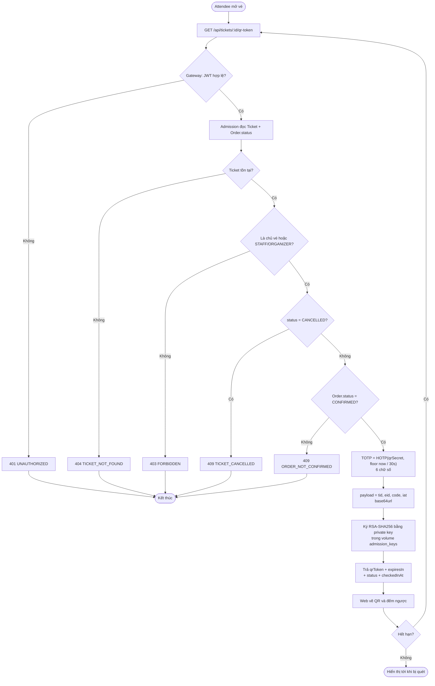
```mermaid
flowchart TD
    S([Attendee mở vé]) --> A["GET /api/tickets/:id/qr-token"]
    A --> B{"Gateway: JWT hợp lệ?"}
    B -- Không --> B1["401 UNAUTHORIZED"] --> Z([Kết thúc])
    B -- Có --> C["Admission đọc Ticket + Order.status"]
    C --> D{"Ticket tồn tại?"}
    D -- Không --> D1["404 TICKET_NOT_FOUND"] --> Z
    D -- Có --> E{"Là chủ vé hoặc STAFF/ORGANIZER?"}
    E -- Không --> E1["403 FORBIDDEN"] --> Z
    E -- Có --> F{"status = CANCELLED?"}
    F -- Có --> F1["409 TICKET_CANCELLED"] --> Z
    F -- Không --> G{"Order.status = CONFIRMED?"}
    G -- Không --> G1["409 ORDER_NOT_CONFIRMED"] --> Z
    G -- Có --> H["TOTP = HOTP(qrSecret, floor now / 30s)<br/>6 chữ số"]
    H --> I["payload = tid, eid, code, iat<br/>base64url"]
    I --> J["Ký RSA-SHA256 bằng private key<br/>trong volume admission_keys"]
    J --> K["Trả qrToken + expiresIn<br/>+ status + checkedInAt"]
    K --> L["Web vẽ QR và đếm ngược"]
    L --> M{"Hết hạn?"}
    M -- Có --> A
    M -- Không --> N([Hiển thị tới khi bị quét])
```

## 3.5. Soát vé QR online

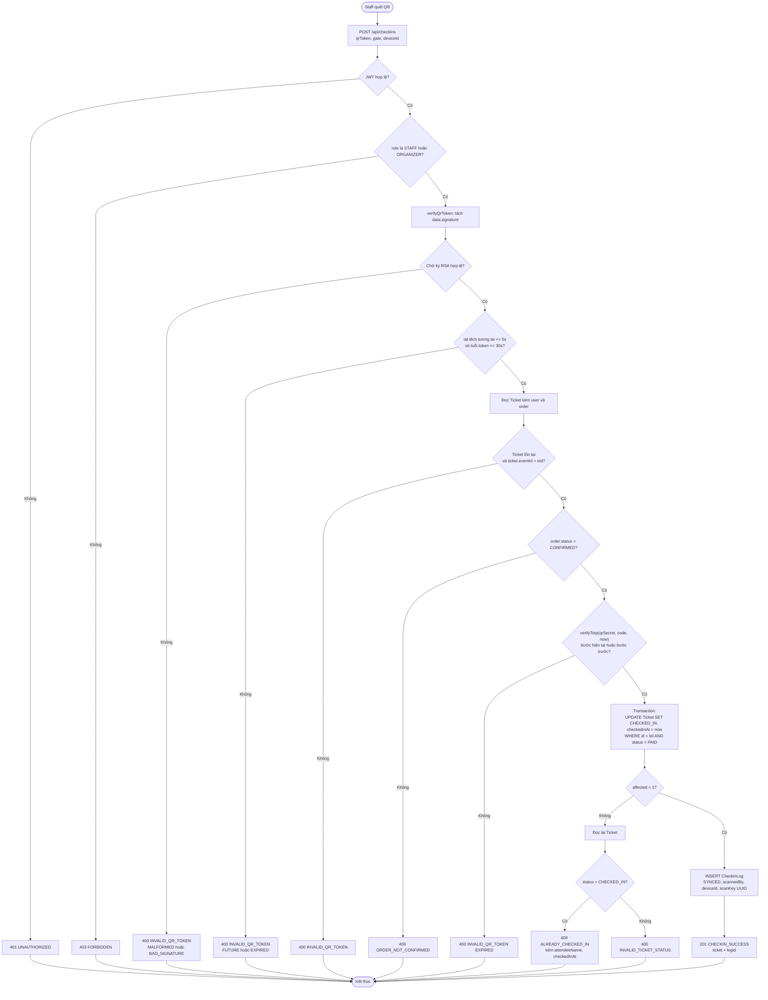
```mermaid
flowchart TD
    S([Staff quét QR]) --> A["POST /api/checkins<br/>qrToken, gate, deviceId"]
    A --> B{"JWT hợp lệ?"}
    B -- Không --> B1["401 UNAUTHORIZED"] --> Z([Kết thúc])
    B -- Có --> C{"role là STAFF hoặc ORGANIZER?"}
    C -- Không --> C1["403 FORBIDDEN"] --> Z
    C -- Có --> D["verifyQrToken: tách data.signature"]
    D --> E{"Chữ ký RSA hợp lệ?"}
    E -- Không --> E1["400 INVALID_QR_TOKEN<br/>MALFORMED hoặc BAD_SIGNATURE"] --> Z
    E -- Có --> F{"iat lệch tương lai <= 5s<br/>và tuổi token <= 30s?"}
    F -- Không --> F1["400 INVALID_QR_TOKEN<br/>FUTURE hoặc EXPIRED"] --> Z
    F -- Có --> G["Đọc Ticket kèm user và order"]
    G --> H{"Ticket tồn tại<br/>và ticket.eventId = eid?"}
    H -- Không --> H1["400 INVALID_QR_TOKEN"] --> Z
    H -- Có --> I{"order.status = CONFIRMED?"}
    I -- Không --> I1["409 ORDER_NOT_CONFIRMED"] --> Z
    I -- Có --> J{"verifyTotp(qrSecret, code, now)<br/>bước hiện tại hoặc bước trước?"}
    J -- Không --> J1["400 INVALID_QR_TOKEN EXPIRED"] --> Z
    J -- Có --> K["Transaction:<br/>UPDATE Ticket SET CHECKED_IN, checkedInAt = now<br/>WHERE id = tid AND status = PAID"]
    K --> L{"affected = 1?"}
    L -- Không --> M["Đọc lại Ticket"]
    M --> M1{"status = CHECKED_IN?"}
    M1 -- Có --> M2["409 ALREADY_CHECKED_IN<br/>kèm attendeeName, checkedInAt"] --> Z
    M1 -- Không --> M3["400 INVALID_TICKET_STATUS"] --> Z
    L -- Có --> N["INSERT CheckinLog<br/>SYNCED, scannedBy, deviceId, scanKey UUID"]
    N --> O["201 CHECKIN_SUCCESS<br/>ticket + logId"] --> Z
```

## 3.6. Đồng bộ lượt quét offline

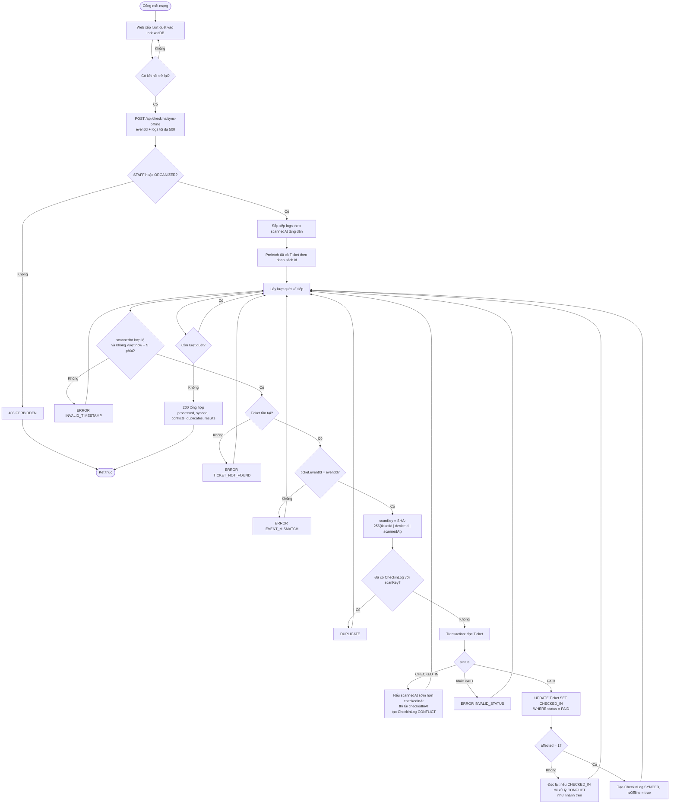
```mermaid
flowchart TD
    S([Cổng mất mạng]) --> A["Web xếp lượt quét vào IndexedDB"]
    A --> B{"Có kết nối trở lại?"}
    B -- Không --> A
    B -- Có --> C["POST /api/checkins/sync-offline<br/>eventId + logs tối đa 500"]
    C --> D{"STAFF hoặc ORGANIZER?"}
    D -- Không --> D1["403 FORBIDDEN"] --> Z([Kết thúc])
    D -- Có --> E["Sắp xếp logs theo scannedAt tăng dần"]
    E --> F["Prefetch tất cả Ticket theo danh sách id"]
    F --> G["Lấy lượt quét kế tiếp"]
    G --> H{"scannedAt hợp lệ<br/>và không vượt now + 5 phút?"}
    H -- Không --> H1["ERROR INVALID_TIMESTAMP"] --> G
    H -- Có --> I{"Ticket tồn tại?"}
    I -- Không --> I1["ERROR TICKET_NOT_FOUND"] --> G
    I -- Có --> J{"ticket.eventId = eventId?"}
    J -- Không --> J1["ERROR EVENT_MISMATCH"] --> G
    J -- Có --> K["scanKey = SHA-256(ticketId | deviceId | scannedAt)"]
    K --> L{"Đã có CheckinLog với scanKey?"}
    L -- Có --> L1["DUPLICATE"] --> G
    L -- Không --> M["Transaction: đọc Ticket"]
    M --> N{"status"}
    N -- "CHECKED_IN" --> N1["Nếu scannedAt sớm hơn checkedInAt<br/>thì lùi checkedInAt<br/>tạo CheckinLog CONFLICT"] --> G
    N -- "khác PAID" --> N2["ERROR INVALID_STATUS"] --> G
    N -- "PAID" --> O["UPDATE Ticket SET CHECKED_IN<br/>WHERE status = PAID"]
    O --> P{"affected = 1?"}
    P -- Không --> P1["Đọc lại; nếu CHECKED_IN thì xử lý CONFLICT<br/>như nhánh trên"] --> G
    P -- Có --> Q["Tạo CheckinLog SYNCED, isOffline = true"] --> G
    G --> R{"Còn lượt quét?"}
    R -- Có --> G
    R -- Không --> T["200 tổng hợp<br/>processed, synced, conflicts, duplicates, results"] --> Z
```

## 3.7. Hỏi đáp Q&A

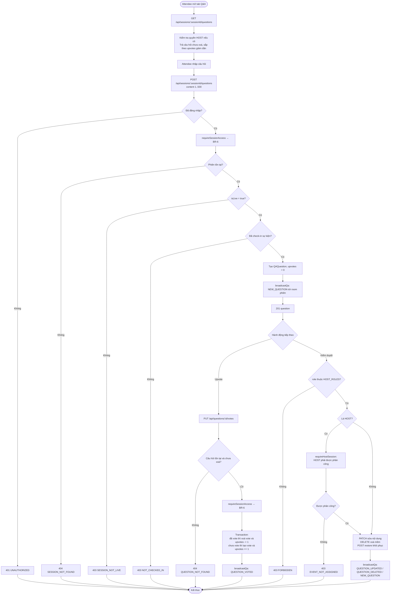
```mermaid
flowchart TD
    S([Attendee mở tab Q&A]) --> A["GET /api/sessions/:sessionId/questions"]
    A --> B["Kiểm tra quyền HOST nếu có<br/>Trả câu hỏi chưa xoá, sắp theo upvotes giảm dần"]
    B --> C["Attendee nhập câu hỏi"]
    C --> D["POST /api/sessions/:sessionId/questions<br/>content 1..500"]
    D --> E{"Đã đăng nhập?"}
    E -- Không --> E1["401 UNAUTHORIZED"] --> Z([Kết thúc])
    E -- Có --> F["requireSessionAccess → BR-6"]
    F --> G{"Phiên tồn tại?"}
    G -- Không --> G1["404 SESSION_NOT_FOUND"] --> Z
    G -- Có --> H{"isLive = true?"}
    H -- Không --> H1["403 SESSION_NOT_LIVE"] --> Z
    H -- Có --> I{"Đã check-in sự kiện?"}
    I -- Không --> I1["403 NOT_CHECKED_IN"] --> Z
    I -- Có --> J["Tạo QAQuestion, upvotes = 0"]
    J --> K["broadcastQa: NEW_QUESTION tới room phiên"]
    K --> L["201 question"]
    L --> M{"Hành động tiếp theo"}
    M -- "Upvote" --> N["PUT /api/questions/:id/votes"]
    N --> O{"Câu hỏi tồn tại và chưa xoá?"}
    O -- Không --> O1["404 QUESTION_NOT_FOUND"] --> Z
    O -- Có --> P["requireSessionAccess → BR-6"]
    P --> Q["Transaction:<br/>đã vote thì xoá vote và upvotes -= 1<br/>chưa vote thì tạo vote và upvotes += 1"]
    Q --> R["broadcastQa: QUESTION_VOTED"] --> Z
    M -- "Kiểm duyệt" --> T{"role thuộc HOST_ROLES?"}
    T -- Không --> T1["403 FORBIDDEN"] --> Z
    T -- Có --> U{"Là HOST?"}
    U -- Có --> U1["requireHostSession:<br/>HOST phải được phân công"]
    U -- Không --> V["PATCH sửa nội dung<br/>DELETE xoá mềm<br/>POST restore khôi phục"]
    U1 --> U2{"Được phân công?"}
    U2 -- Không --> U3["403 EVENT_NOT_ASSIGNED"] --> Z
    U2 -- Có --> V
    V --> W["broadcastQa:<br/>QUESTION_UPDATED / QUESTION_DELETED / NEW_QUESTION"] --> Z
```

## 3.8. Bình chọn (poll)

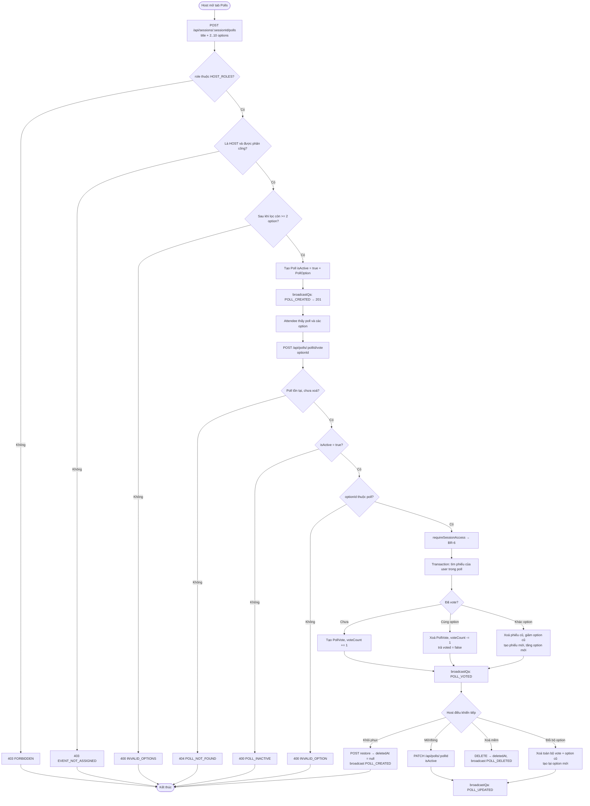
```mermaid
flowchart TD
    S([Host mở tab Polls]) --> A["POST /api/sessions/:sessionId/polls<br/>title + 2..10 options"]
    A --> B{"role thuộc HOST_ROLES?"}
    B -- Không --> B1["403 FORBIDDEN"] --> Z([Kết thúc])
    B -- Có --> C{"Là HOST và được phân công?"}
    C -- Không --> C1["403 EVENT_NOT_ASSIGNED"] --> Z
    C -- Có --> D{"Sau khi lọc còn >= 2 option?"}
    D -- Không --> D1["400 INVALID_OPTIONS"] --> Z
    D -- Có --> E["Tạo Poll isActive = true + PollOption"]
    E --> F["broadcastQa: POLL_CREATED → 201"]
    F --> G["Attendee thấy poll và các option"]
    G --> H["POST /api/polls/:pollId/vote<br/>optionId"]
    H --> I{"Poll tồn tại, chưa xoá?"}
    I -- Không --> I1["404 POLL_NOT_FOUND"] --> Z
    I -- Có --> J{"isActive = true?"}
    J -- Không --> J1["400 POLL_INACTIVE"] --> Z
    J -- Có --> K{"optionId thuộc poll?"}
    K -- Không --> K1["400 INVALID_OPTION"] --> Z
    K -- Có --> L["requireSessionAccess → BR-6"]
    L --> M["Transaction: tìm phiếu của user trong poll"]
    M --> N{"Đã vote?"}
    N -- "Chưa" --> O["Tạo PollVote, voteCount += 1"] --> T
    N -- "Cùng option" --> P["Xoá PollVote, voteCount -= 1<br/>trả voted = false"] --> T
    N -- "Khác option" --> Q["Xoá phiếu cũ, giảm option cũ<br/>tạo phiếu mới, tăng option mới"] --> T
    T["broadcastQa: POLL_VOTED"] --> U{"Host điều khiển tiếp"}
    U -- "Mở/đóng" --> V["PATCH /api/polls/:pollId<br/>isActive"] --> W["broadcastQa: POLL_UPDATED"]
    U -- "Đổi bộ option" --> X["Xoá toàn bộ vote + option cũ<br/>tạo lại option mới"] --> W
    U -- "Xoá mềm" --> Y["DELETE → deletedAt, broadcast POLL_DELETED"]
    U -- "Khôi phục" --> Y1["POST restore → deletedAt = null<br/>broadcast POLL_CREATED"] --> Z
```

## 3.9. Quiz — sinh và điều khiển

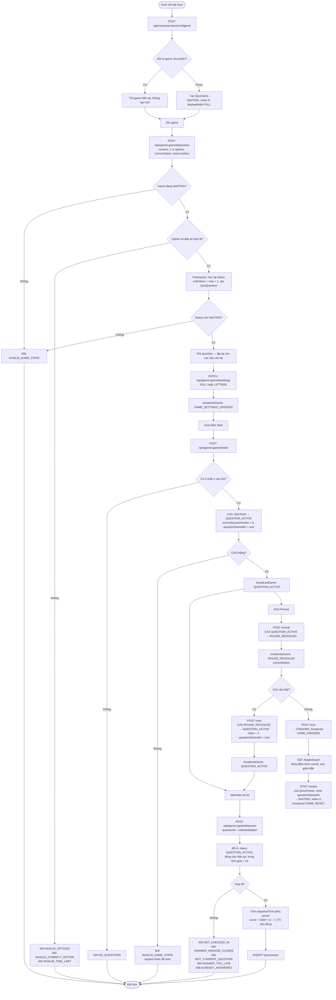
```mermaid
flowchart TD
    S([Host mở tab Quiz]) --> A["POST /api/sessions/:sessionId/game"]
    A --> B{"Đã có game cho phiên?"}
    B -- Có --> B1["Trả game hiện tại, không tạo mới"]
    B -- Chưa --> C["Tạo QuizGame<br/>WAITING, index 0, displayMode FULL"]
    C --> D["201 game"]
    B1 --> D
    D --> E["POST /api/game/:gameId/question<br/>content, 2..6 options, correctOption, timeLimitSec"]
    E --> F{"Game đang WAITING?"}
    F -- Không --> F1["409 INVALID_GAME_STATE"] --> Z([Kết thúc])
    F -- Có --> G{"Option và đáp án hợp lệ?"}
    G -- Không --> G1["400 INVALID_OPTIONS<br/>400 INVALID_CORRECT_OPTION<br/>400 INVALID_TIME_LIMIT"] --> Z
    G -- Có --> H["Transaction: đọc lại status,<br/>orderNum = max + 1, tạo QuizQuestion"]
    H --> I{"Status còn WAITING?"}
    I -- Không --> F1
    I -- Có --> J["201 question — lặp lại cho các câu còn lại"]
    J --> K["PATCH /api/game/:gameId/settings<br/>FULL hoặc LETTERS"]
    K --> L["broadcastGame: GAME_SETTINGS_UPDATED"]
    L --> M["Host bấm Start"]
    M --> N["POST /api/game/:gameId/start"]
    N --> O{"Có ít nhất 1 câu hỏi?"}
    O -- Không --> O1["400 NO_QUESTIONS"] --> Z
    O -- Có --> P["CAS: WAITING → QUESTION_ACTIVE<br/>currentQuestionIndex = 0, questionStartedAt = now"]
    P --> Q{"CAS thắng?"}
    Q -- Không --> Q1["409 INVALID_GAME_STATE<br/>request khác đã start"] --> Z
    Q -- Có --> R["broadcastGame: QUESTION_ACTIVE"]
    R --> T["Attendee trả lời"]
    T --> U["POST /api/game/:gameId/answer<br/>questionId + selectedOption"]
    U --> V["BR-6, status QUESTION_ACTIVE,<br/>đúng câu hiện tại, trong thời gian + 2s"]
    V --> W{"Hợp lệ?"}
    W -- Không --> W1["403 NOT_CHECKED_IN<br/>400 ANSWER_WINDOW_CLOSED<br/>400 NOT_CURRENT_QUESTION<br/>400 ANSWER_TOO_LATE<br/>409 ALREADY_ANSWERED"] --> Z
    W -- Có --> X["Tính responseTime phía server<br/>score = 1000 × (1 - t / 2T) nếu đúng"]
    X --> Y["INSERT QuizAnswer"] --> Z
    R --> R1["Host Reveal"]
    R1 --> R2["POST /reveal<br/>CAS QUESTION_ACTIVE → ROUND_REVEALED"]
    R2 --> R3["broadcastGame: ROUND_REVEALED<br/>correctOption"]
    R3 --> R4{"Còn câu tiếp?"}
    R4 -- Có --> R5["POST /next<br/>CAS ROUND_REVEALED → QUESTION_ACTIVE<br/>index + 1, questionStartedAt = now"]
    R5 --> R6["broadcastGame: QUESTION_ACTIVE"] --> T
    R4 -- Không --> R7["POST /end<br/>→ FINISHED, broadcast GAME_FINISHED"]
    R7 --> R8["GET /leaderboard<br/>tổng điểm theo userId, sort giảm dần"]
    R8 --> R9["POST /restart<br/>xoá QuizAnswer, reset questionStartedAt<br/>→ WAITING, index 0, broadcast GAME_RESET"]
```

## 3.10. Phân công host và kiểm tra BR-7

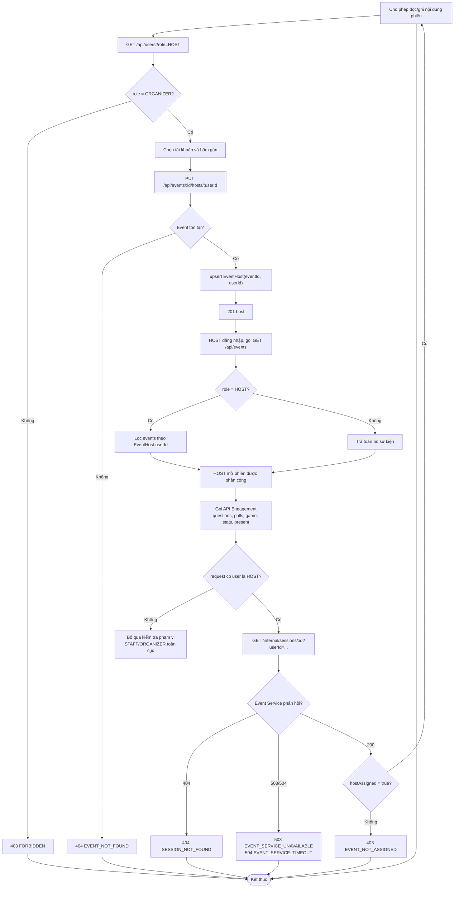
```mermaid
flowchart TD
    S([Organizer mở tab Người dẫn]) --> A["GET /api/users?role=HOST"]
    A --> B{"role = ORGANIZER?"}
    B -- Không --> B1["403 FORBIDDEN"] --> Z([Kết thúc])
    B -- Có --> C["Chọn tài khoản và bấm gán"]
    C --> D["PUT /api/events/:id/hosts/:userId"]
    D --> E{"Event tồn tại?"}
    E -- Không --> E1["404 EVENT_NOT_FOUND"] --> Z
    E -- Có --> F["upsert EventHost(eventId, userId)"]
    F --> G["201 host"]
    G --> H["HOST đăng nhập, gọi GET /api/events"]
    H --> I{"role = HOST?"}
    I -- Có --> J["Lọc events theo EventHost.userId"]
    I -- Không --> K["Trả toàn bộ sự kiện"]
    J --> L["HOST mở phiên được phân công"]
    K --> L
    L --> M["Gọi API Engagement<br/>questions, polls, game, stats, present"]
    M --> N{"request có user là HOST?"}
    N -- Không --> O["Bỏ qua kiểm tra phạm vi<br/>STAFF/ORGANIZER toàn cục"]
    N -- Có --> P["GET /internal/sessions/:id?userId=..."]
    P --> Q{"Event Service phản hồi?"}
    Q -- "404" --> Q1["404 SESSION_NOT_FOUND"] --> Z
    Q -- "503/504" --> Q2["503 EVENT_SERVICE_UNAVAILABLE<br/>504 EVENT_SERVICE_TIMEOUT"] --> Z
    Q -- "200" --> R{"hostAssigned = true?"}
    R -- Không --> R1["403 EVENT_NOT_ASSIGNED"] --> Z
    R -- Có --> S["Cho phép đọc/ghi nội dung phiên"] --> Z
```

## 3.11. Màn trình chiếu của Host

```mermaid
flowchart TD
    S([Host mở /present hoặc /present/:sessionId]) --> A["Tải danh sách sự kiện, phiên<br/>và dữ liệu Q&A, poll, quiz, leaderboard"]
    A --> B["Mở WebSocket /ws/qa?token=...<br/>và /ws/game?token=..."]
    B --> C{"Gateway xác thực JWT?"}
    C -- Không --> C1["Đóng socket mã 4401"]
    C -- Có --> D["Proxy sang Engagement"]
    D --> E["Gửi JOIN_SESSION / JOIN_GAME"]
    E --> F["Nhận NEW_QUESTION, QUESTION_VOTED,<br/>POLL_UPDATED, QUESTION_ACTIVE, ROUND_REVEALED ..."]
    C1 --> G["useRealtime chuyển sang polling"]
    F --> H["Dựng danh sách slide:<br/>Mở đầu → Hỏi đáp → từng Bình chọn → Quiz → Xếp hạng"]
    G --> H
    H --> I{"Host thao tác"}
    I -- "← → hoặc click chấm" --> J["Đổi slide"]
    I -- "F toàn màn hình" --> K["Fullscreen API"]
    I -- "T nền sáng/tối" --> L["Đổi theme, lưu localStorage"]
    I -- "Cỡ chữ / màu nhấn / logo" --> M["CSS scale, accent, logo qEvent"]
    I -- "Poll" --> N["Mở/đóng bình chọn<br/>PATCH /api/polls/:id"]
    I -- "Quiz" --> O["Start / Reveal / Next / End / Restart<br/>POST /api/game/:id/..."]
    I -- "Đổi phiên" --> P["Ô chọn phiên góc trái<br/>chỉ liệt kê phiên được phân công"]
    N --> Q["broadcast WebSocket tới khán giả"]
    O --> Q
    Q --> R["Khán giả cập nhật tức thời<br/>hoặc polling khi socket gián đoạn"]
```

## 3.12. Biểu đồ trạng thái các đối tượng

### 3.12.1. `Order`

```mermaid
stateDiagram-v2
    [*] --> PENDING : POST /api/orders
    PENDING --> CONFIRMED : giữ chỗ 2xx + cấp vé
    PENDING --> FAILED : Event trả 4xx
    PENDING --> PENDING_RECONCILIATION : timeout / 5xx / InfraError
    PENDING --> PENDING_RECONCILIATION : crash trước khi gọi Event
    PENDING_RECONCILIATION --> CONFIRMED : worker replay thành công
    PENDING_RECONCILIATION --> FAILED : worker nhận 4xx
    CONFIRMED --> COMPENSATING : cấp vé lỗi
    COMPENSATING --> FAILED : release thành công
    COMPENSATING --> COMPENSATING : release lỗi, thử lại
    CONFIRMED --> [*]
    FAILED --> [*]
```

### 3.12.2. `Ticket`

```mermaid
stateDiagram-v2
    [*] --> PAID : issueTickets tạo vé + qrSecret
    PAID --> CHECKED_IN : quét QR online CAS thành công
    PAID --> CHECKED_IN : đồng bộ offline CAS thành công
    PAID --> CANCELLED : huỷ vé
    CHECKED_IN --> CHECKED_IN : quét lại bị từ chối 409
    CHECKED_IN --> [*]
    CANCELLED --> [*]
```

### 3.12.3. `Reservation`

```mermaid
stateDiagram-v2
    [*] --> CONFIRMED : giữ chỗ thành công
    CONFIRMED --> RELEASED : DELETE /internal/reservations/:operationId
    RELEASED --> RELEASED : gọi lại trả 200
    CONFIRMED --> CONFIRMED : replay cùng operationId
    RELEASED --> [*]
```

### 3.12.4. `QuizGame`

```mermaid
stateDiagram-v2
    [*] --> WAITING : tạo game
    WAITING --> QUESTION_ACTIVE : start
    QUESTION_ACTIVE --> ROUND_REVEALED : reveal
    ROUND_REVEALED --> QUESTION_ACTIVE : next
    ROUND_REVEALED --> FINISHED : end
    QUESTION_ACTIVE --> FINISHED : end
    WAITING --> FINISHED : end
    FINISHED --> WAITING : restart
    ROUND_REVEALED --> WAITING : restart
    FINISHED --> [*]
```

### 3.12.5. Kết quả một lượt quét offline

```mermaid
stateDiagram-v2
    [*] --> SYNCED : vé còn PAID, CAS thành công
    [*] --> CONFLICT : vé đã CHECKED_IN
    [*] --> DUPLICATE : scanKey đã tồn tại
    [*] --> ERROR : timestamp / vé / sự kiện / trạng thái không hợp lệ
    SYNCED --> [*]
    CONFLICT --> [*]
    DUPLICATE --> [*]
    ERROR --> [*]
```

> `SYNCED` và `CONFLICT` là giá trị thật của `CheckinLog.syncStatus`. `DUPLICATE` chỉ trả trong `results`
> khi `scanKey` đã có (không tạo log mới). `ERROR` là kết quả phân loại, **không** tạo bản ghi `CheckinLog`.

---

# 4. Biểu đồ CSDL

Hệ thống dùng **database-per-service**. Ba sơ đồ dưới đây là ba database vật lý độc lập, không có foreign key
xuyên database.

## 4.1. Database `qevent_event` (Event Service)

```mermaid
erDiagram
    Event {
        uuid id PK
        string name
        string venue
        datetime startTime
        datetime endTime
        int maxCapacity
        int reservedCount
        datetime createdAt
        datetime updatedAt
    }

    Room {
        uuid id PK
        uuid eventId FK
        string name
        int capacity
    }

    Session {
        uuid id PK
        uuid eventId FK
        string title
        string speaker
        datetime startTime
        datetime endTime
        boolean isLive
    }

    TicketType {
        uuid id PK
        uuid eventId FK
        string name
        float price
        int quota
        int soldCount
    }

    Reservation {
        uuid id PK
        string operationId UK
        uuid eventId FK
        uuid ticketTypeId FK
        int quantity
        string status
        datetime expiresAt
        datetime createdAt
    }

    EventHost {
        uuid id PK
        uuid eventId FK
        string userId
        datetime createdAt
    }

    Event ||--o{ Room : "1 - n"
    Event ||--o{ Session : "1 - n"
    Event ||--o{ TicketType : "1 - n"
    Event ||--o{ EventHost : "1 - n"
    TicketType ||--o{ Reservation : "1 - n"
```

| Bảng | Khóa / chỉ mục | Ghi chú thiết kế |
|---|---|---|
| `Event` | PK `id` | `reservedCount` là bộ đếm nguyên tử, không suy ra từ `Reservation` khi đọc |
| `Room` | PK `id`; index `eventId`; FK `eventId → Event.id` ON DELETE CASCADE | Phòng thuộc đúng một sự kiện |
| `Session` | PK `id`; index `eventId`; FK CASCADE | `isLive` là cờ duy nhất quyết định BR-6 |
| `TicketType` | PK `id`; index `eventId`; FK CASCADE | `soldCount` được giữ chỗ/hoàn trả cùng transaction với `Event.reservedCount` |
| `Reservation` | PK `id`; UNIQUE `operationId`; index `eventId`; FK `ticketTypeId` CASCADE | `operationId` là khóa replay của saga |
| `EventHost` | PK `id`; UNIQUE `(eventId, userId)`; index `userId`; FK CASCADE | Nguồn sự thật của BR-7 |

## 4.2. Database `qevent_admission` (Admission Service)

```mermaid
erDiagram
    User {
        uuid id PK
        string email UK
        string passwordHash
        string fullName
        string role
        datetime createdAt
    }

    Order {
        uuid id PK
        uuid userId FK
        uuid eventId
        uuid ticketTypeId
        string idempotencyKey
        string operationId UK
        string status
        int quantity
        float totalAmount
        string failureCode
        datetime leaseUntil
        int attempts
        datetime createdAt
        datetime updatedAt
    }

    IdempotencyLog {
        uuid id PK
        uuid userId FK
        string key
        string fingerprint
        uuid orderId FK
        string status
        int responseStatus
        string responseBody
        datetime createdAt
        datetime updatedAt
    }

    Ticket {
        uuid id PK
        uuid orderId FK
        uuid userId FK
        uuid eventId
        uuid ticketTypeId
        string status
        string qrSecret
        datetime checkedInAt
        datetime createdAt
        datetime updatedAt
    }

    CheckinLog {
        uuid id PK
        uuid ticketId FK
        string scannedBy
        datetime scannedAt
        boolean isOffline
        string deviceId
        string syncStatus
        string scanKey UK
    }

    User ||--o{ Order : "đặt"
    User ||--o{ Ticket : "sở hữu"
    User ||--o{ IdempotencyLog : "gửi"
    Order ||--|{ Ticket : "cấp"
    Order |o--o| IdempotencyLog : "ánh xạ"
    Ticket ||--o{ CheckinLog : "ghi nhận"
```

| Bảng | Khóa / chỉ mục | Ghi chú thiết kế |
|---|---|---|
| `User` | PK `id`; UNIQUE `email` | `role` là enum `Role`: `ORGANIZER`, `HOST`, `STAFF`, `ATTENDEE` |
| `Order` | PK `id`; UNIQUE `operationId` | `status` là chuỗi: `PENDING`, `CONFIRMED`, `FAILED`, `PENDING_RECONCILIATION`, `COMPENSATING` |
| `IdempotencyLog` | PK `id`; UNIQUE `(userId, key)`; UNIQUE `orderId`; index `status`; FK `userId`, `orderId` | Lưu cả `responseStatus` + `responseBody` để replay nguyên văn |
| `Ticket` | PK `id`; index `(userId, eventId)`; index `(eventId, updatedAt)`; FK `orderId`, `userId` | `qrSecret` ngẫu nhiên 20 byte, không bao giờ trả ra ngoài |
| `CheckinLog` | PK `id`; UNIQUE `scanKey`; index `ticketId`, `scannedAt`; FK `ticketId` | `scanKey = SHA-256(ticketId | deviceId | scannedAt)` chống đồng bộ trùng |

> Lưu ý: `Order.ticketTypeId` và `Ticket.ticketTypeId` là **scalar**, không có FK vì `TicketType` thuộc database khác.

## 4.3. Database `qevent_engagement` (Engagement Service)

```mermaid
erDiagram
    QAQuestion {
        uuid id PK
        uuid sessionId
        string userId
        string content
        int upvotes
        datetime createdAt
        datetime deletedAt
    }

    QAVote {
        uuid id PK
        uuid questionId FK
        string userId
    }

    Poll {
        uuid id PK
        uuid sessionId
        string title
        boolean isActive
        datetime createdAt
        datetime deletedAt
    }

    PollOption {
        uuid id PK
        uuid pollId FK
        string content
        int voteCount
    }

    PollVote {
        uuid id PK
        uuid optionId FK
        string userId
    }

    QuizGame {
        uuid id PK
        uuid sessionId UK
        string status
        int currentQuestionIndex
        string displayMode
    }

    QuizQuestion {
        uuid id PK
        uuid gameId FK
        int orderNum
        string content
        string options
        int correctOption
        int timeLimitSec
        datetime questionStartedAt
        datetime deletedAt
    }

    QuizAnswer {
        uuid id PK
        uuid questionId FK
        string userId
        int selectedOption
        int responseTimeMs
        int score
        datetime answeredAt
    }

    QAQuestion ||--o{ QAVote : "nhận"
    Poll ||--|{ PollOption : "gồm"
    PollOption ||--o{ PollVote : "nhận"
    QuizGame ||--o{ QuizQuestion : "chứa"
    QuizQuestion ||--o{ QuizAnswer : "nhận"
```

| Bảng | Khóa / chỉ mục | Ghi chú thiết kế |
|---|---|---|
| `QAQuestion` | PK `id` | `deletedAt` là xoá mềm; restore không mất upvote |
| `QAVote` | PK `id`; UNIQUE `(questionId, userId)`; FK CASCADE | Một người chỉ upvote một lần |
| `PollOption` | PK `id`; FK CASCADE | `voteCount` là bộ đếm phi chuẩn hoá, cập nhật cùng transaction với `PollVote` |
| `PollVote` | PK `id`; UNIQUE `(optionId, userId)`; FK CASCADE | Đổi option = xoá phiếu cũ + tạo phiếu mới |
| `QuizGame` | PK `id`; UNIQUE `sessionId` | Mỗi phiên tối đa một game; `displayMode`: `FULL` hoặc `LETTERS` |
| `QuizQuestion` | PK `id`; UNIQUE `(gameId, orderNum)`; FK CASCADE | `options` là mảng chuỗi; `deletedAt` xoá mềm; `questionStartedAt` là mốc tính điểm |
| `QuizAnswer` | PK `id`; UNIQUE `(questionId, userId)`; FK CASCADE | `responseTimeMs` do server đo, không tin client |

## 4.4. Tham chiếu xuyên service (không có FK)

```mermaid
erDiagram
    Event {
        uuid id PK
    }
    Session {
        uuid id PK
        uuid eventId FK
    }
    TicketType {
        uuid id PK
        uuid eventId FK
    }
    User {
        uuid id PK
        string email
    }
    Order {
        uuid id PK
        uuid eventId
        uuid ticketTypeId
    }
    Ticket {
        uuid id PK
        uuid eventId
        uuid ticketTypeId
    }
    EventHost {
        uuid id PK
        uuid eventId
        string userId
    }
    QAQuestion {
        uuid id PK
        uuid sessionId
    }
    Poll {
        uuid id PK
        uuid sessionId
    }
    QuizGame {
        uuid id PK
        uuid sessionId
    }

    Event ||--o{ Session : "cùng DB"
    Event ||--o{ TicketType : "cùng DB"
    Event ||--o{ EventHost : "cùng DB"
    Session ||..o{ QAQuestion : "sessionId tham chiếu"
    Session ||..o{ Poll : "sessionId tham chiếu"
    Session ||..o{ QuizGame : "sessionId tham chiếu"
    User ||..o{ EventHost : "userId tham chiếu"
    Event ||..o{ Order : "eventId tham chiếu"
    Event ||..o{ Ticket : "eventId tham chiếu"
    TicketType ||..o{ Order : "ticketTypeId tham chiếu"
    TicketType ||..o{ Ticket : "ticketTypeId tham chiếu"
```

> Đường `||..o{` biểu diễn quan hệ **logic** bằng scalar, không phải foreign key. Không service nào join hai
> database; mọi nhu cầu dữ liệu chéo đi qua endpoint nội bộ.

---

# 5. Biểu đồ lớp DAO

## 5.1. Quy ước

Trong mã nguồn, lớp truy cập dữ liệu được hiện thực bằng **Prisma Client**: mỗi DAO tương ứng một delegate
(`prisma.event`, `prisma.order`, ...) và được gọi qua đối tượng `Deps`. Sơ đồ dưới đây chuẩn hoá các delegate
thành lớp DAO để thấy rõ ranh giới ba tầng:

```text
Route/Controller  →  Service (nghiệp vụ)  →  DAO (Prisma delegate)  →  PostgreSQL
```

Quy ước:

| Ký hiệu | Ý nghĩa |
|---|---|
| `<<Controller>>` | Hàm route Elysia: validate, phân quyền, map HTTP status |
| `<<Service>>` | Nghiệp vụ, transaction, gọi service khác |
| `<<DAO>>` | Truy vấn/ghi một model; không chứa luật nghiệp vụ |
| `<<Client>>` | HTTP client nội bộ hoặc hạ tầng dùng chung |

## 5.2. DAO tầng Event Service

```mermaid
classDiagram
    direction TB

    namespace EventControllers {
        class EventController {
            <<Controller>>
            +listEvents(headers)
            +getEvent(id, headers)
            +createEvent(body, headers)
            +updateEvent(id, body, headers)
            +addRoom(eventId, body)
            +updateRoom(eventId, roomId, body)
            +addSession(eventId, body)
            +updateSession(eventId, sessionId, body)
            +addTicketType(eventId, body)
            +updateTicketType(eventId, id, body)
            +listHosts(eventId)
            +assignHost(eventId, userId)
            +unassignHost(eventId, userId)
        }

        class InternalController {
            <<Controller>>
            +createReservation(body)
            +releaseReservation(operationId)
            +getInternalEvent(id)
            +getInternalSession(id, userId)
        }
    }

    namespace EventServices {
        class EventService {
            <<Service>>
            +listEvents(hostUserId)
            +getEvent(id, hostUserId)
            +createEvent(input)
            +updateEvent(id, patch)
            +addRoom(eventId, input)
            +addSession(eventId, input)
            +addTicketType(eventId, input)
            +assignEventHost(eventId, userId)
            +unassignEventHost(eventId, userId)
            +isEventHost(eventId, userId) bool
        }

        class ReservationService {
            <<Service>>
            +createReservation(input)
            +releaseReservation(operationId)
            -replay(existing, input)
            -soldOut()
        }
    }

    namespace EventDAOs {
        class EventDao {
            <<DAO>>
            +findMany(hostUserId) Event[]
            +findUnique(id) Event
            +exists(id) bool
            +createWithRelations(input) Event
            +update(id, patch) Event
            +setMaxCapacityCas(id, cap) int
            +holdSeats(eventId, qty) int
            +releaseSeats(eventId, qty) void
        }

        class RoomDao {
            <<DAO>>
            +create(eventId, input) Room
            +findByIdInEvent(roomId, eventId) Room
            +update(id, patch) Room
        }

        class SessionDao {
            <<DAO>>
            +create(eventId, input) Session
            +findUniqueWithEvent(id) Session
            +findByIdInEvent(sessionId, eventId) Session
            +update(id, patch) Session
        }

        class TicketTypeDao {
            <<DAO>>
            +create(eventId, input) TicketType
            +findUnique(id) TicketType
            +findByIdInEvent(id, eventId) TicketType
            +update(id, patch) TicketType
            +holdQuota(id, qty) int
            +releaseQuota(id, qty) void
        }

        class ReservationDao {
            <<DAO>>
            +findByOperationId(operationId) Reservation
            +create(input) Reservation
            +claimRelease(id) int
            +findById(id) Reservation
            +transaction(fn) result
        }

        class EventHostDao {
            <<DAO>>
            +findUnique(eventId, userId) EventHost
            +findMany(eventId) EventHost[]
            +upsert(eventId, userId) EventHost
            +deleteMany(eventId, userId) int
        }

        class PrismaEventClient {
            <<Client>>
            +event EventDao
            +room RoomDao
            +session SessionDao
            +ticketType TicketTypeDao
            +reservation ReservationDao
            +eventHost EventHostDao
            +executeRaw(sql, params) int
        }
    }

    EventController --> EventService
    InternalController --> EventService
    InternalController --> ReservationService
    EventService --> EventDao
    EventService --> RoomDao
    EventService --> SessionDao
    EventService --> TicketTypeDao
    EventService --> EventHostDao
    ReservationService --> ReservationDao
    ReservationService --> EventDao
    ReservationService --> TicketTypeDao
    ReservationDao --> PrismaEventClient
    EventDao --> PrismaEventClient
    RoomDao --> PrismaEventClient
    SessionDao --> PrismaEventClient
    TicketTypeDao --> PrismaEventClient
    EventHostDao --> PrismaEventClient
```

## 5.3. DAO tầng Admission Service

```mermaid
classDiagram
    direction TB

    namespace AdmissionControllers {
        class AuthController {
            <<Controller>>
            +register(body)
            +login(body)
            +me(currentUser)
        }
        class OrderController {
            <<Controller>>
            +placeOrder(body, key, currentUser)
            +listOrders(query, currentUser)
            +getOrder(id, currentUser)
        }
        class TicketController {
            <<Controller>>
            +listTickets(query, currentUser)
            +listMyTickets(currentUser)
            +getTicket(id, currentUser)
            +getQrToken(id, currentUser)
        }
        class CheckinController {
            <<Controller>>
            +checkIn(body, currentUser)
            +syncOffline(body, currentUser)
            +getStats(query, currentUser)
            +listCheckins(query, currentUser)
        }
        class AdmissionInternalController {
            <<Controller>>
            +verifyAccess(userId, eventId)
        }
        class UserController {
            <<Controller>>
            +listUsers(role, currentUser)
        }
    }

    namespace AdmissionServices {
        class AuthService {
            <<Service>>
            +register(email, password, fullName)
            +login(email, password)
            +currentUser()
            -signJwt(user)
        }
        class OrderService {
            <<Service>>
            +placeOrder(user, key, input)
            +listOrders(query)
            -continueOrder(ctx)
            -issueTickets(orderId, reservation)
            -markPending(orderId, status)
            -markFailed(orderId, code)
            -replay(log, fingerprint)
        }
        class ReconciliationWorker {
            <<Service>>
            +reconcileOnce(limit) int
            -reconcileOrder(order)
        }
        class CheckinService {
            <<Service>>
            +checkIn(user, input)
            +syncOffline(user, eventId, scans)
            -classifyScan(scan)
        }
        class QrService {
            <<Service>>
            +generateTotp(secret, at) string
            +verifyTotp(secret, code, at) bool
            +buildQrToken(ticket, at) QrToken
            +verifyQrToken(token, at) QrVerification
            +signQrToken(payload) string
        }
        class EventGatewayClient {
            <<Client>>
            +createReservation(input) Response
            +releaseReservation(operationId) Response
        }
        class KeyStore {
            <<Client>>
            +privateKey string
            +publicKey string
            +loadOrCreate() KeyPair
        }
    }

    namespace AdmissionDAOs {
        class UserDao {
            <<DAO>>
            +findByEmail(email) User
            +findById(id) User
            +create(input) User
            +findManyByRole(role) User[]
        }
        class OrderDao {
            <<DAO>>
            +create(input) Order
            +findById(id) Order
            +findByIdWithTickets(id) Order
            +updateStatus(id, status, patch) Order
            +listPaged(query) Order[]
            +groupByStatus(eventId) Group[]
            +findReconcilable(now, graceMs, limit) Order[]
            +claimForReconcile(id, status, now, leaseMs) int
            +clearLease(id) void
        }
        class IdempotencyLogDao {
            <<DAO>>
            +findByUserAndKey(userId, key) IdempotencyLog
            +create(userId, key, fingerprint, orderId) IdempotencyLog
            +markCompleted(userId, key, status, body) void
            +markPending(userId, key) void
        }
        class TicketDao {
            <<DAO>>
            +createForOrder(order, unitPrice) Ticket
            +findByIdWithUserAndOrder(id) Ticket
            +findManyPaged(query) Ticket[]
            +findMyTickets(userId) Ticket[]
            +countByEvent(eventId, status) int
            +claimCheckIn(ticketId, at) int
            +findFirstCheckedIn(userId, eventId) Ticket
        }
        class CheckinLogDao {
            <<DAO>>
            +create(input) CheckinLog
            +findByScanKey(scanKey) CheckinLog
            +listPaged(query) CheckinLog[]
            +groupByDevice(eventId) Group[]
            +findLast(eventId) CheckinLog
        }
        class PrismaAdmissionClient {
            <<Client>>
            +user UserDao
            +order OrderDao
            +idempotencyLog IdempotencyLogDao
            +ticket TicketDao
            +checkinLog CheckinLogDao
            +transaction(fn) result
        }
    }

    AuthController --> AuthService
    OrderController --> OrderService
    TicketController --> TicketDao
    TicketController --> QrService
    TicketController --> KeyStore
    CheckinController --> CheckinService
    AdmissionInternalController --> TicketDao
    UserController --> UserDao

    AuthService --> UserDao
    AuthService --> KeyStore

    OrderService --> OrderDao
    OrderService --> IdempotencyLogDao
    OrderService --> TicketDao
    OrderService --> EventGatewayClient

    ReconciliationWorker --> OrderDao
    ReconciliationWorker --> IdempotencyLogDao
    ReconciliationWorker --> EventGatewayClient
    ReconciliationWorker --> OrderService

    CheckinService --> TicketDao
    CheckinService --> CheckinLogDao
    CheckinService --> QrService

    QrService --> KeyStore

    UserDao --> PrismaAdmissionClient
    OrderDao --> PrismaAdmissionClient
    IdempotencyLogDao --> PrismaAdmissionClient
    TicketDao --> PrismaAdmissionClient
    CheckinLogDao --> PrismaAdmissionClient
```

## 5.4. DAO tầng Engagement Service

```mermaid
classDiagram
    direction TB

    namespace EngagementControllers {
        class QaController {
            <<Controller>>
            +listQuestions(sessionId, currentUser)
            +askQuestion(sessionId, body, currentUser)
            +toggleVote(questionId, currentUser)
            +editQuestion(questionId, body, currentUser)
            +deleteQuestion(questionId, currentUser)
            +restoreQuestion(questionId, currentUser)
        }
        class PollController {
            <<Controller>>
            +listPolls(sessionId, currentUser)
            +createPoll(sessionId, body, currentUser)
            +vote(pollId, body, currentUser)
            +updatePoll(pollId, body, currentUser)
            +deletePoll(pollId, currentUser)
            +restorePoll(pollId, currentUser)
        }
        class GameController {
            <<Controller>>
            +getGame(gameId, currentUser)
            +getSessionGame(sessionId, currentUser)
            +createGame(sessionId, currentUser)
            +updateSettings(gameId, body, currentUser)
            +addQuestion(gameId, body, currentUser)
            +editQuestion(gameId, questionId, body, currentUser)
            +deleteQuestion(gameId, questionId, currentUser)
            +restoreQuestion(gameId, questionId, currentUser)
            +start(gameId, currentUser)
            +reveal(gameId, currentUser)
            +next(gameId, currentUser)
            +end(gameId, currentUser)
            +restart(gameId, currentUser)
            +answer(gameId, body, currentUser)
            +leaderboard(gameId, currentUser)
        }
        class StatsController {
            <<Controller>>
            +sessionStats(sessionId, currentUser)
        }
        class WsController {
            <<Controller>>
            +openQa(ws)
            +joinQa(ws, message)
            +openGame(ws)
            +joinGame(ws, message)
            +close(ws)
        }
    }

    namespace EngagementGuards {
        class AccessGuard {
            <<Service>>
            +requireSessionAccess(userId, sessionId) SessionAccessInfo
            -upstreamFailure(service, error) AccessError
        }
        class HostGuard {
            <<Service>>
            +requireHostSession(currentUser, set, sessionId) ErrorBody
        }
        class ScoreCalculator {
            <<Service>>
            +calculateQuizScore(isCorrect, responseTimeMs, timeLimitSec) int
        }
    }

    namespace EngagementClients {
        class EventHttpClient {
            <<Client>>
            +getSession(sessionId, userId) SessionAccessInfo
        }
        class AdmissionHttpClient {
            <<Client>>
            +verifyAccess(userId, eventId) AccessVerification
            +clearCache() void
        }
        class Broadcaster {
            <<Client>>
            +subscribeQa(sessionId, client) Function
            +broadcastQa(sessionId, payload) void
            +subscribeGame(gameId, client) Function
            +broadcastGame(gameId, payload) void
        }
    }

    namespace EngagementDAOs {
        class QAQuestionDao {
            <<DAO>>
            +findManyActive(sessionId) QAQuestion[]
            +findManyDeleted(sessionId) QAQuestion[]
            +findById(id) QAQuestion
            +create(input) QAQuestion
            +updateContent(id, content) QAQuestion
            +softDelete(id) void
            +restore(id) QAQuestion
        }
        class QAVoteDao {
            <<DAO>>
            +findByQuestionAndUser(questionId, userId) QAVote
            +create(questionId, userId) QAVote
            +delete(id) void
        }
        class PollDao {
            <<DAO>>
            +findManyActive(sessionId) Poll[]
            +findManyDeleted(sessionId) Poll[]
            +findByIdWithOptions(id) Poll
            +findById(id) Poll
            +create(sessionId, title, options) Poll
            +update(id, patch) Poll
            +softDelete(id) void
            +restore(id) Poll
        }
        class PollOptionDao {
            <<DAO>>
            +replaceAll(pollId, options) void
            +findByIdInPoll(optionId, pollId) PollOption
            +increment(optionId) void
            +decrement(optionId) void
        }
        class PollVoteDao {
            <<DAO>>
            +findByUserInPoll(userId, pollId) PollVote
            +create(optionId, userId) PollVote
            +delete(id) void
            +deleteAllInPoll(pollId) void
        }
        class QuizGameDao {
            <<DAO>>
            +findBySessionId(sessionId) QuizGame
            +findById(id) QuizGame
            +create(sessionId) QuizGame
            +updateSettings(id, displayMode) QuizGame
            +updateStatusCas(id, from, to, patch) int
            +reset(id) void
        }
        class QuizQuestionDao {
            <<DAO>>
            +findManyActive(gameId) QuizQuestion[]
            +findManyDeleted(gameId) QuizQuestion[]
            +findByIdInGame(questionId, gameId) QuizQuestion
            +maxOrderNum(gameId) int
            +create(gameId, input, orderNum) QuizQuestion
            +update(id, patch) QuizQuestion
            +markStarted(id, at) void
            +softDelete(id) void
            +restore(id) QuizQuestion
            +resetStartedAt(gameId) void
        }
        class QuizAnswerDao {
            <<DAO>>
            +findByQuestionAndUser(questionId, userId) QuizAnswer
            +create(input) QuizAnswer
            +deleteAllForGame(gameId) void
            +findAllForGame(gameId) QuizAnswer[]
        }
        class PrismaEngagementClient {
            <<Client>>
            +qAQuestion QAQuestionDao
            +qAVote QAVoteDao
            +poll PollDao
            +pollOption PollOptionDao
            +pollVote PollVoteDao
            +quizGame QuizGameDao
            +quizQuestion QuizQuestionDao
            +quizAnswer QuizAnswerDao
            +transaction(fn) result
        }
    }

    QaController --> AccessGuard
    QaController --> HostGuard
    QaController --> QAQuestionDao
    QaController --> QAVoteDao
    QaController --> Broadcaster

    PollController --> AccessGuard
    PollController --> HostGuard
    PollController --> PollDao
    PollController --> PollOptionDao
    PollController --> PollVoteDao
    PollController --> Broadcaster

    GameController --> AccessGuard
    GameController --> HostGuard
    GameController --> ScoreCalculator
    GameController --> QuizGameDao
    GameController --> QuizQuestionDao
    GameController --> QuizAnswerDao
    GameController --> Broadcaster

    StatsController --> HostGuard
    StatsController --> QAQuestionDao
    StatsController --> PollDao
    StatsController --> QuizGameDao

    WsController --> EventHttpClient
    WsController --> Broadcaster

    AccessGuard --> EventHttpClient
    AccessGuard --> AdmissionHttpClient
    HostGuard --> EventHttpClient

    QAQuestionDao --> PrismaEngagementClient
    QAVoteDao --> PrismaEngagementClient
    PollDao --> PrismaEngagementClient
    PollOptionDao --> PrismaEngagementClient
    PollVoteDao --> PrismaEngagementClient
    QuizGameDao --> PrismaEngagementClient
    QuizQuestionDao --> PrismaEngagementClient
    QuizAnswerDao --> PrismaEngagementClient
```

## 5.5. Bảng đối chiếu DAO ↔ model ↔ thao tác nghiệp vụ

| Service | DAO | Model | Thao tác tiêu biểu |
|---|---|---|---|
| Event | `EventDao` | `Event` | đọc danh sách theo host, tạo kèm quan hệ, CAS `maxCapacity`, giữ/hoàn chỗ |
| Event | `RoomDao`, `SessionDao`, `TicketTypeDao` | `Room`, `Session`, `TicketType` | CRUD theo `eventId`, CAS `soldCount`/quota |
| Event | `ReservationDao` | `Reservation` | `findByOperationId`, `create`, `claimRelease` trong transaction |
| Event | `EventHostDao` | `EventHost` | `upsert`, `deleteMany`, kiểm tra phân công |
| Admission | `UserDao` | `User` | đăng ký, đăng nhập, liệt kê tài khoản HOST |
| Admission | `OrderDao` | `Order` | tạo đơn, chuyển trạng thái, quét đơn treo, claim lease |
| Admission | `IdempotencyLogDao` | `IdempotencyLog` | tra khóa, lưu fingerprint, replay response |
| Admission | `TicketDao` | `Ticket` | cấp vé, CAS check-in, thống kê |
| Admission | `CheckinLogDao` | `CheckinLog` | ghi log online/offline, chống trùng `scanKey` |
| Engagement | `QAQuestionDao`, `QAVoteDao` | `QAQuestion`, `QAVote` | đăng câu hỏi, upvote, xoá mềm/khôi phục |
| Engagement | `PollDao`, `PollOptionDao`, `PollVoteDao` | `Poll`, `PollOption`, `PollVote` | tạo poll, đổi phiếu, đóng/mở, xoá mềm |
| Engagement | `QuizGameDao`, `QuizQuestionDao`, `QuizAnswerDao` | `QuizGame`, `QuizQuestion`, `QuizAnswer` | state machine CAS, chấm điểm, leaderboard, reset |

---

# 6. Biểu đồ tuần tự kèm mô tả từng bước

> Quy ước: số trên mũi tên trong biểu đồ trùng với số trong danh sách bước ngay bên dưới.
> Nhánh rẽ dùng hậu tố `a`, `b` (ví dụ `6a`) để không lệch thứ tự luồng chính.

## 6.1. Luồng biên tại API Gateway

```mermaid
sequenceDiagram
    participant C as Client
    participant G as API Gateway
    participant CB as Circuit Breaker
    participant S as Service đích

    C->>G: 1. Request tới /api/*
    G->>G: 2. Gán x-request-id, lấy IP client
    G->>G: 3. Nếu login/register: kiểm tra rate limit
    alt IP đang bị chặn
        G-->>C: 3a. 429 TOO_MANY_ATTEMPTS
    end
    G->>G: 4. Map prefix sang service
    alt Không khớp prefix
        G-->>C: 4a. 404 ROUTE_NOT_FOUND
    end
    G->>G: 5. Xoá x-user-id, x-user-role, host<br/>gắn x-request-id
    G->>G: 6. Verify Bearer JWT nếu có
    alt Token sai hoặc hết hạn
        G-->>C: 6a. 401 UNAUTHORIZED
    end
    G->>CB: 7. Lấy breaker theo service, fire với timeout 2s
    CB->>S: 8. Forward request + header tin cậy
    S-->>CB: 9. Response
    CB-->>G: 10. Trả response cho gateway
    G->>G: 11. Xoá hop-by-hop header<br/>login 401 thì ghi failure, ok thì reset
    G-->>C: 12. Forward status, header, body
    alt Circuit mở hoặc không kết nối được
        G-->>C: 12a. 503 SERVICE_UNAVAILABLE + circuitState
    end
    alt Quá timeout
        G-->>C: 12b. 504 GATEWAY_TIMEOUT
    end
    G->>G: 13. Ghi log JSON: requestId, method, path, service, status, durationMs
```

**Các bước**

1. Client gọi một địa chỉ công khai duy nhất (`:8000`), path bắt đầu bằng `/api/`.
2. Gateway gán `x-request-id` (hoặc giữ header client gửi) và lấy IP để giới hạn tần suất.
3. Với `POST /api/auth/login` và `POST /api/auth/register`, kiểm tra bộ đếm trong bộ nhớ.
   3a. Login bị chặn sau 10 lần sai trong 5 phút; register bị chặn sau 20 lượt trong 1 phút → `429`.
4. Chọn service theo prefix: `/api/events` → Event; `/api/auth`, `/api/users`, `/api/orders`, `/api/tickets`,
   `/api/checkins` → Admission; `/api/sessions`, `/api/polls`, `/api/questions`, `/api/game` → Engagement.
   4a. Không khớp → `404 ROUTE_NOT_FOUND`.
5. Clone header, **xoá** `x-user-id`, `x-user-role`, `host` do client có thể giả mạo; gắn `x-request-id`.
6. Nếu có `Authorization: Bearer`, verify JWT; hợp lệ thì gắn lại `x-user-id`, `x-user-role` từ claims.
   6a. Token sai/hết hạn → `401 UNAUTHORIZED`.
7. Lấy `opossum` breaker của service đích; timeout 2 giây.
8. Forward request (method, query, body, header đã làm sạch) tới service.
9. Service xử lý và trả response.
10. Breaker trả kết quả; lỗi được phân loại timeout hay không kết nối.
11. Xoá `transfer-encoding`, `connection`; với login: `401` ghi nhận failure, `2xx` reset bộ đếm IP.
12. Forward nguyên status/body về client, kèm `x-request-id`.
    12a. Circuit mở hoặc service không truy cập được → `503 SERVICE_UNAVAILABLE` + `circuitState`.
    12b. Quá 2 giây → `504 GATEWAY_TIMEOUT`.
13. Ghi log JSON có `requestId`, `service`, `status`, `durationMs` để đối chiếu khi debug liên service.

## 6.2. Đăng ký tài khoản Attendee

```mermaid
sequenceDiagram
    participant A as Attendee
    participant G as API Gateway
    participant AS as Admission Service
    participant AD as CSDL vé

    A->>G: 1. POST /api/auth/register
    G->>G: 2. Rate limit đăng ký 20 lượt/phút/IP
    G->>AS: 3. Proxy request
    AS->>AS: 4. Chuẩn hoá email, kiểm tra độ dài
    AS->>AD: 5. findUnique User theo email
    AD-->>AS: 6. Kết quả tìm kiếm
    alt Email đã tồn tại
        AS-->>A: 6a. 409 EMAIL_TAKEN
    end
    AS->>AS: 7. bcrypt.hash(password, 10)
    AS->>AD: 8. create User với role ATTENDEE
    alt Vi phạm unique do race
        AS-->>A: 8a. 409 EMAIL_TAKEN
    end
    AS->>AS: 9. Ký JWT 24h: sub, id, email, role
    AS-->>G: 10. 201 token + user
    G-->>A: 11. Forward 201
    A->>A: 12. Lưu token, điều hướng dashboard
```

**Các bước**

1. Attendee gửi `email`, `password` (tối thiểu 8 ký tự), `fullName`.
2. Gateway đếm lượt đăng ký theo IP.
3. Chuyển request tới Admission Service.
4. Admission `trim()` và `toLowerCase()` email; `trim()` họ tên.
5. Tra `User` theo email.
6. Nếu tìm thấy → dừng. 6a. `409 EMAIL_TAKEN`.
7. Băm mật khẩu bằng bcrypt cost 10.
8. Tạo `User` với `role = ATTENDEE`; **bỏ qua** trường `role` client gửi (chống leo thang quyền).
   8a. Nếu hai request đăng ký cùng email đua nhau, Prisma trả `P2002` → `409 EMAIL_TAKEN`.
9. Ký JWT HS256 hạn 24 giờ chứa `sub`, `id`, `email`, `role`.
10. Trả `201 {token, user}`.
11. Gateway forward nguyên response.
12. Web lưu token và mở dashboard theo vai trò.

## 6.3. Đăng nhập

```mermaid
sequenceDiagram
    participant U as Người dùng
    participant G as API Gateway
    participant AS as Admission Service
    participant AD as CSDL vé

    U->>G: 1. POST /api/auth/login
    alt IP đang bị chặn
        G-->>U: 2. 429 TOO_MANY_ATTEMPTS
    end
    G->>AS: 3. Proxy request
    AS->>AD: 4. findUnique User theo email
    AD-->>AS: 5. User hoặc null
    AS->>AS: 6. bcrypt.compare(password, passwordHash)
    alt Sai email hoặc mật khẩu
        AS-->>G: 6a. 401 INVALID_CREDENTIALS
        G->>G: 6b. Ghi nhận failure cho IP
        G-->>U: 6c. 401
    end
    AS->>AS: 7. Ký JWT 24h với role hiện tại
    AS-->>G: 8. 200 token + user
    G->>G: 9. Reset bộ đếm failure của IP
    G-->>U: 10. Forward 200
    U->>U: 11. Lưu token, shell hiển thị menu theo role
```

**Các bước**

1. Người dùng gửi email và mật khẩu.
2. Nếu IP đã có 10 lần đăng nhập sai trong 5 phút → `429`.
3. Gateway chuyển tiếp tới Admission.
4. Tìm `User` theo email đã chuẩn hoá.
5. Nhận bản ghi hoặc `null`.
6. So khớp bcrypt.
   6a. Sai → `401 INVALID_CREDENTIALS` (không tiết lộ email có tồn tại hay không).
   6b. Gateway ghi nhận một failure cho IP.
   6c. Trả `401` cho client.
7. Ký JWT 24 giờ; role lấy từ DB, không lấy từ body.
8. Trả `200 {token, user}`.
9. Gateway reset bộ đếm failure của IP.
10. Forward response.
11. Client lưu token; `RequireRole` và `AppShell` hiển thị menu theo `ATTENDEE` / `STAFF` / `HOST` / `ORGANIZER`.

## 6.4. Organizer tạo sự kiện

```mermaid
sequenceDiagram
    participant O as Organizer
    participant W as Web console
    participant G as API Gateway
    participant E as Event Service
    participant ED as CSDL sự kiện

    O->>W: 1. Mở Events, nhập form sự kiện
    W->>G: 2. POST /api/events + Bearer token
    G->>G: 3. Verify JWT, gắn x-user-id, x-user-role
    G->>E: 4. Proxy qua circuit breaker
    E->>E: 5. requireOrganizer
    alt Không phải ORGANIZER
        E-->>W: 5a. 403 FORBIDDEN
    end
    E->>E: 6. Parse thời gian, kiểm tra start < end và start >= now
    alt Thời gian sai
        E-->>W: 6a. 422 INVALID_EVENT_TIME
    end
    E->>E: 7. Validate từng session
    alt Session sai giờ
        E-->>W: 7a. 422 INVALID_SESSION_TIME
    end
    E->>ED: 8. create Event kèm rooms, sessions, ticketTypes
    ED-->>E: 9. Event đầy đủ quan hệ
    E-->>W: 10. 201 event
    W-->>O: 11. Mở tab Rooms, Sessions, Ticket types, Hosts
```

**Các bước**

1. Organizer điền tên, địa điểm, thời gian, sức chứa, có thể kèm phòng/phiên/loại vé.
2. Web gọi `POST /api/events`.
3. Gateway xác thực JWT và gắn danh tính đã xác thực.
4. Chuyển tiếp tới Event Service.
5. Kiểm tra `x-user-role === "ORGANIZER"`.
   5a. `STAFF`/`HOST`/`ATTENDEE` nhận `403 FORBIDDEN` — **Staff không tạo được sự kiện**.
6. Kiểm tra `startTime < endTime` và `startTime >= now`.
   6a. Vi phạm → `422 INVALID_EVENT_TIME`.
7. Nếu có `sessions[]`, kiểm tra từng phiên `start < end`.
   7a. Vi phạm → `422 INVALID_SESSION_TIME`.
8. Prisma nested write tạo `Event` + `Room[]` + `Session[]` + `TicketType[]` trong một lần ghi.
9. Trả entity kèm quan hệ.
10. Trả `201`.
11. Console mở các tab cấu hình; mọi thao tác sau đó đều yêu cầu `ORGANIZER`.

## 6.5. Phân công Host cho sự kiện

```mermaid
sequenceDiagram
    participant O as Organizer
    participant W as Web console
    participant G as API Gateway
    participant AS as Admission Service
    participant E as Event Service
    participant ED as CSDL sự kiện

    O->>W: 1. Mở tab Người dẫn
    W->>G: 2. GET /api/users?role=HOST
    G->>AS: 3. Proxy admission
    AS->>AS: 4. Kiểm tra role ORGANIZER
    alt Không phải ORGANIZER
        AS-->>W: 4a. 403 FORBIDDEN
    end
    AS-->>W: 5. 200 danh sách tài khoản HOST
    O->>W: 6. Chọn tài khoản, bấm gán
    W->>G: 7. PUT /api/events/:id/hosts/:userId
    G->>E: 8. Proxy event service
    E->>E: 9. requireOrganizer
    E->>ED: 10. Kiểm tra Event tồn tại
    alt Không tồn tại
        E-->>W: 10a. 404 EVENT_NOT_FOUND
    end
    E->>ED: 11. upsert EventHost theo cặp eventId, userId
    E-->>W: 12. 201 host
    W-->>O: 13. Danh sách host được làm mới
```

**Các bước**

1. Organizer mở tab **Người dẫn** của trang sự kiện.
2. Web lấy danh sách tài khoản `HOST` để chọn.
3. Gateway chuyển tới Admission Service (`/api/users`).
4. Admission chỉ cho `ORGANIZER` đọc danh sách tài khoản.
   4a. Vai trò khác → `403 FORBIDDEN`.
5. Trả danh sách `{id, email, fullName, role}`, không có `passwordHash`.
6. Organizer chọn một tài khoản và bấm gán.
7. Web gọi `PUT /api/events/:id/hosts/:userId`.
8. Gateway chuyển tới Event Service.
9. Event kiểm tra quyền `ORGANIZER`.
10. Kiểm tra sự kiện tồn tại.
    10a. Không có → `404 EVENT_NOT_FOUND`.
11. `upsert` bản ghi `EventHost` — gọi lại nhiều lần vẫn idempotent nhờ unique `(eventId, userId)`.
12. Trả `201 host`.
13. Web tải lại danh sách; từ đây `HOST` thấy sự kiện này trong `GET /api/events`.

## 6.6. Đặt vé — luồng thành công

```mermaid
sequenceDiagram
    participant A as Attendee
    participant G as API Gateway
    participant AS as Admission Service
    participant ES as Event Service
    participant AD as CSDL vé
    participant ED as CSDL sự kiện

    A->>G: 1. POST /api/orders + Idempotency-Key + body
    G->>G: 2. Verify JWT, xoá header giả, gắn x-user-id
    G->>AS: 3. Proxy qua circuit breaker
    AS->>AD: 4. findUnique IdempotencyLog theo userId và key
    AD-->>AS: 5. null
    AS->>AS: 6. fingerprint = SHA-256 của payload
    AS->>AD: 7. Transaction: create Order PENDING + log IN_PROGRESS
    AD-->>AS: 8. Order kèm operationId
    AS->>ES: 9. POST /internal/reservations + x-service-token
    ES->>ED: 10. findUnique Reservation theo operationId
    ED-->>ES: 11. null
    ES->>ED: 12. Transaction: UPDATE reservedCount, UPDATE soldCount
    ES->>ED: 13. create Reservation CONFIRMED
    ED-->>ES: 14. Reservation + giá vé
    ES-->>AS: 15. 201 reservation + unitPrice
    AS->>AD: 16. Transaction: Order sang CONFIRMED, tạo qty Ticket PAID
    AD-->>AS: 17. order + tickets
    AS->>AD: 18. IdempotencyLog sang COMPLETED, lưu status 201 và body
    AS-->>G: 19. 201
    G-->>A: 20. 201 order + tickets
    A->>A: 21. Hiển thị vé và nút QR
```

**Các bước**

1. Attendee gửi `eventId`, `ticketTypeId`, `quantity` (1–10) kèm `Idempotency-Key`.
2. Gateway xác thực JWT, làm sạch header, gắn `x-user-id`.
3. Chuyển tiếp sang Admission Service.
4. Tìm `IdempotencyLog` theo `(userId, key)`.
5. Không có bản ghi → đây là yêu cầu mới.
6. Tính fingerprint SHA-256 của `{eventId, ticketTypeId, quantity}`.
7. Trong transaction: tạo `Order` trạng thái `PENDING` với `operationId` UUID, tạo log `IN_PROGRESS`.
8. Nhận `orderId` và `operationId`.
9. Gọi nội bộ Event Service kèm `x-service-token`, timeout 1 giây, không retry.
10. Event tra `Reservation` theo `operationId` để chống giữ chỗ hai lần.
11. Chưa có → tiếp tục giữ chỗ.
12. Trong transaction: `UPDATE Event SET reservedCount += qty WHERE reservedCount + qty <= maxCapacity`;
    sau đó `UPDATE TicketType SET soldCount += qty WHERE soldCount + qty <= quota`.
13. Tạo `Reservation` trạng thái `CONFIRMED`, `expiresAt = now + 10 phút`.
14. Trả reservation kèm `unitPrice` của loại vé.
15. Event trả `201`; bất kỳ `4xx` nào cũng là từ chối nghiệp vụ, không phải lỗi hạ tầng.
16. Admission chạy transaction cấp vé: CAS `Order → CONFIRMED`, `totalAmount = unitPrice × quantity`,
    chèn `quantity` bản ghi `Ticket` trạng thái `PAID` với `qrSecret` ngẫu nhiên 20 byte.
17. Trả order kèm danh sách vé.
18. Ghi đè log idempotency thành `COMPLETED`, lưu `responseStatus = 201` và `responseBody`.
19. Admission trả `201`.
20. Gateway forward `201`.
21. Web hiển thị vé; attendee có thể mở QR động.

> Các kiểm tra chi tiết bên trong Event Service — `TicketType` tồn tại, lệch `eventId`, CAS `soldCount`,
> replay `operationId`, race `P2002` — nằm ở biểu đồ **“Chi tiết giữ chỗ bên Event Service”** (mục 3.2).

## 6.7. Đặt vé — hết chỗ

```mermaid
sequenceDiagram
    participant A as Attendee
    participant G as API Gateway
    participant AS as Admission Service
    participant ES as Event Service
    participant AD as CSDL vé
    participant ED as CSDL sự kiện

    A->>G: 1. POST /api/orders + Idempotency-Key
    G->>AS: 2. Proxy sau khi xác thực JWT
    AS->>AD: 3. Tìm IdempotencyLog theo userId và key
    AD-->>AS: 4. null
    AS->>AD: 5. Transaction: Order PENDING + log IN_PROGRESS
    AS->>ES: 6. POST /internal/reservations
    ES->>ED: 7. Kiểm tra Reservation theo operationId
    ED-->>ES: 8. null
    ES->>ED: 9. UPDATE Event reservedCount với điều kiện sức chứa
    ED-->>ES: 10. affected = 0
    ES->>ED: 11. ROLLBACK transaction
    ES-->>AS: 12. 409 SOLD_OUT
    AS->>AD: 13. Order sang FAILED, failureCode SOLD_OUT
    AS->>AD: 14. Log sang COMPLETED với status 409
    AS-->>G: 15. 409 SOLD_OUT
    G-->>A: 16. 409 SOLD_OUT
    A->>A: 17. Hiển thị hết chỗ, không tạo vé
```

**Các bước**

1. Attendee gửi yêu cầu đặt vé.
2. Gateway xác thực và chuyển tiếp.
3. Admission tra log idempotency.
4. Không có → yêu cầu mới.
5. Tạo `Order PENDING` + log `IN_PROGRESS`.
6. Gọi Event giữ chỗ.
7. Event kiểm tra `operationId` chưa được dùng.
8. Chưa có reservation.
9. Câu `UPDATE Event` có điều kiện `reservedCount + qty <= maxCapacity`.
10. Không dòng nào bị ảnh hưởng → hết sức chứa sự kiện (hoặc bước `UPDATE TicketType` trả 0 vì hết quota).
11. Transaction rollback, không có reservation và không trừ chỗ.
12. Event trả `409 SOLD_OUT`.
13. Admission đánh dấu đơn `FAILED`, lưu `failureCode`.
14. Ghi log idempotency `COMPLETED` với status 409 để retry sau trả lại đúng kết quả.
15. Trả `409` cho gateway.
16. Gateway forward `409`.
17. Client hiển thị thông báo; **không** có vé nào được tạo.

> Nhánh hết quota loại vé và nhánh lệch `eventId` của `TicketType` nằm trong cùng biểu đồ chi tiết ở mục 3.2.

## 6.8. Đặt vé — Event Service không phản hồi

```mermaid
sequenceDiagram
    participant A as Attendee
    participant G as API Gateway
    participant AS as Admission Service
    participant ES as Event Service
    participant AD as CSDL vé

    A->>G: 1. POST /api/orders + Idempotency-Key
    G->>AS: 2. Proxy sau khi xác thực JWT
    AS->>AD: 3. Tạo Order PENDING + log IN_PROGRESS
    AS->>ES: 4. POST /internal/reservations, timeout 1s
    ES--xAS: 5. Không phản hồi hoặc trả 5xx
    AS->>AS: 6. Phân loại InfraError, không phải từ chối nghiệp vụ
    AS->>AD: 7. Order sang PENDING_RECONCILIATION
    AS->>AD: 8. Log sang PENDING
    AS-->>G: 9. 202 order + Location
    G-->>A: 10. 202 + Location
    A->>A: 11. Theo dõi đơn, chưa kết luận thành công hay thất bại
    Note over AS,AD: Worker đối soát sẽ xử lý ở mục 6.9
```

**Các bước**

1. Attendee gửi yêu cầu.
2. Gateway xác thực và chuyển tiếp.
3. Admission tạo đơn `PENDING` và log `IN_PROGRESS` trước khi gọi chéo — nhờ vậy không mất đơn.
4. Gọi Event với timeout 1 giây.
5. Không có phản hồi, hoặc phản hồi `5xx`, hoặc lỗi mạng.
6. `resilient-fetch` ném `InfraError`; đây **không** phải `4xx` nghiệp vụ.
7. Đơn chuyển `PENDING_RECONCILIATION` (chưa biết Event đã giữ chỗ hay chưa).
8. Log idempotency chuyển `PENDING` để retry cùng key vẫn nhận `202`.
9. Trả `202` kèm `Location: /api/orders/:id`.
10. Gateway forward `202`.
11. Client hiển thị “đang xử lý”; đơn không bị mất và không bị báo sai là thất bại.

> Worker đối soát (mục 6.9) replay bằng đúng `operationId`, nên nếu Event đã giữ chỗ thì nhận lại
> reservation cũ thay vì giữ thêm lần nữa.

## 6.9. Worker đối soát đơn treo

```mermaid
sequenceDiagram
    participant T as Timer
    participant R as Reconciler
    participant AD as CSDL vé
    participant ES as Event Service
    participant ED as CSDL sự kiện

    T->>R: 1. Mỗi 5 giây gọi reconcileOnce(10)
    R->>AD: 2. Tìm PENDING_RECONCILIATION, COMPENSATING, PENDING quá hạn lease
    AD-->>R: 3. Danh sách ứng viên
    loop Từng ứng viên
        R->>AD: 4. updateMany claim lease 30s, attempts += 1
        AD-->>R: 5. Số dòng claim được
        alt Không claim được
            R->>R: 5a. Bỏ qua, worker khác đang xử lý
        end
        alt Đơn COMPENSATING
            R->>ES: 6. DELETE /internal/reservations/:operationId
            ES->>ED: 7. Đánh dấu RELEASED, giảm reservedCount và soldCount
            ES-->>R: 8. 200 hoặc lỗi
            R->>AD: 9. Thành công thì Order FAILED + log COMPLETED 409
        else Đơn chờ giữ chỗ
            R->>ES: 10. POST /internal/reservations cùng operationId
            ES-->>R: 11. 2xx, 4xx hoặc 5xx
            R->>AD: 12. 2xx thì CONFIRMED và cấp vé, 4xx thì FAILED và lưu lỗi
        end
        alt Xử lý ném lỗi
            R->>AD: 13. Xoá lease ngay để lượt sau nhặt lại
        end
    end
```

**Các bước**

1. `setInterval` 5 giây gọi `reconcileOnce(deps, 10)`.
2. Chọn đơn `PENDING_RECONCILIATION`, `COMPENSATING`, hoặc `PENDING` cũ hơn cửa sổ lease (chống đơn kẹt do crash),
   đồng thời `leaseUntil` null hoặc đã hết hạn.
3. Nhận danh sách ứng viên theo `createdAt` tăng dần.
4. Với từng đơn, `updateMany` có điều kiện trạng thái + lease để giành quyền xử lý; ghi `leaseUntil = now + 30s`,
   tăng `attempts`. Đây là primitive loại trừ lẫn nhau giữa các worker.
5. Nếu 0 dòng bị ảnh hưởng: 5a. bỏ qua.
6. Nếu đơn `COMPENSATING`: gọi release reservation.
7. Event chuyển `Reservation` sang `RELEASED` và hoàn `reservedCount`/`soldCount` (không xuống dưới 0).
8. Nhận kết quả release.
9. Release thành công → đơn `FAILED`, log idempotency `COMPLETED` 409.
   Release lỗi → giữ `COMPENSATING`, lượt sau thử lại.
10. Ngược lại, replay giữ chỗ bằng đúng `operationId`.
11. Event trả `2xx` (kể cả replay), `4xx` hoặc `5xx`.
12. `2xx` → `issueTickets` chuyển `CONFIRMED`, cấp vé, log `COMPLETED 201`;
    `4xx` → `FAILED`, log `COMPLETED` theo mã lỗi; `5xx`/timeout → giữ nguyên để lượt sau.
13. Nếu `reconcileOrder` ném lỗi, worker xoá lease ngay thay vì chờ 30 giây.

## 6.10. Cấp QR động

```mermaid
sequenceDiagram
    participant A as Attendee
    participant G as API Gateway
    participant AS as Admission Service
    participant AD as CSDL vé

    A->>G: 1. GET /api/tickets/:id/qr-token
    G->>AS: 2. Proxy sau khi xác thực JWT
    AS->>AD: 3. findUnique Ticket kèm order.status
    AD-->>AS: 4. Ticket hoặc null
    AS->>AS: 5. Kiểm tra chủ vé/role, CANCELLED, order CONFIRMED
    alt Không hợp lệ
        AS-->>A: 5a. 404, 403, 409 TICKET_CANCELLED hoặc 409 ORDER_NOT_CONFIRMED
    end
    AS->>AS: 6. TOTP = HOTP(qrSecret, floor now / 30s)
    AS->>AS: 7. Payload tid, eid, code, iat, base64url, ký RSA-SHA256
    AS-->>G: 8. qrToken + expiresIn + status + checkedInAt
    G-->>A: 9. 200
    A->>A: 10. Vẽ QR, đếm ngược 30 giây rồi gọi lại
```

**Các bước**

1. Attendee mở chi tiết vé và bấm hiển thị QR.
2. Gateway xác thực JWT.
3. Admission đọc ticket kèm trạng thái đơn.
4. Không có ticket → dừng.
5. Kiểm tra: người gọi là chủ vé hoặc `STAFF`/`ORGANIZER`; vé không `CANCELLED`; đơn `CONFIRMED`.
   5a. Lần lượt trả `404 TICKET_NOT_FOUND`, `403 FORBIDDEN`, `409 TICKET_CANCELLED`, `409 ORDER_NOT_CONFIRMED`.
6. Sinh TOTP 6 chữ số từ `qrSecret` theo bước 30 giây.
7. Tạo payload `{tid, eid, code, iat}`, encode base64url, ký `RSA-SHA256` bằng private key trong volume.
8. Trả `qrToken`, `expiresIn` (giây còn lại của bước TOTP), trạng thái vé và `checkedInAt`.
9. Gateway forward.
10. Web vẽ QR và tự làm mới trước khi hết hạn; ảnh chụp màn hình cũ sẽ chết sau tối đa 30 giây.

---

## 6.11. Soát vé QR online

```mermaid
sequenceDiagram
    participant S as Staff scanner
    participant G as API Gateway
    participant AS as Admission Service
    participant AD as CSDL vé

    S->>G: 1. POST /api/checkins với qrToken, gate, deviceId
    G->>AS: 2. Proxy sau khi xác thực JWT
    AS->>AS: 3. Kiểm tra role STAFF hoặc ORGANIZER
    alt Sai role
        AS-->>S: 3a. 403 FORBIDDEN
    end
    AS->>AS: 4. verifyQrToken: chữ ký RSA, payload, iat, tuổi token
    alt Token không hợp lệ
        AS-->>S: 4a. 400 INVALID_QR_TOKEN
    end
    AS->>AD: 5. findUnique Ticket kèm user và order
    AD-->>AS: 6. Ticket
    AS->>AS: 7. Kiểm tra ticket.eventId và order.status
    alt Sai sự kiện hoặc đơn chưa xác nhận
        AS-->>S: 7a. 400 INVALID_QR_TOKEN hoặc 409 ORDER_NOT_CONFIRMED
    end
    AS->>AS: 8. verifyTotp với bước hiện tại và bước trước
    alt TOTP sai
        AS-->>S: 8a. 400 INVALID_QR_TOKEN
    end
    AS->>AD: 9. Transaction: UPDATE Ticket SET CHECKED_IN WHERE status = PAID
    AD-->>AS: 10. Số dòng cập nhật
    alt affected = 0
        AS->>AD: 11. Đọc lại Ticket
        AS-->>S: 12. 409 ALREADY_CHECKED_IN kèm attendeeName hoặc 400 INVALID_TICKET_STATUS
    else affected = 1
        AS->>AD: 13. INSERT CheckinLog SYNCED, scannedBy, deviceId, scanKey
        AS-->>G: 14. 201 CHECKIN_SUCCESS
        G-->>S: 15. 201
    end
```

**Các bước**

1. Staff quét mã và gửi token kèm `gate`/`deviceId`.
2. Gateway xác thực JWT rồi chuyển tiếp.
3. Service yêu cầu role `STAFF` hoặc `ORGANIZER`.
   3a. Vai trò khác → `403 FORBIDDEN`.
4. Tách token thành `data.signature`, verify chữ ký RSA-SHA256, parse payload, kiểm tra `iat` không vượt
   hiện tại quá 5 giây và tuổi token không quá 30 giây.
   4a. Lỗi `MALFORMED`, `BAD_SIGNATURE`, `EXPIRED`, `FUTURE` → `400 INVALID_QR_TOKEN`.
5. Đọc ticket kèm người dùng và đơn hàng.
6. Nhận ticket hoặc `null`.
7. So `ticket.eventId` với `eid` trong token; kiểm tra `order.status = CONFIRMED`.
   7a. Lệch sự kiện → `400`; đơn chưa xác nhận → `409 ORDER_NOT_CONFIRMED`.
8. Tính TOTP từ `ticket.qrSecret`, chấp nhận bước hiện tại và bước ngay trước (bù trừ đồng hồ).
   8a. Sai → `400 INVALID_QR_TOKEN`.
9. Trong transaction, chạy `UPDATE Ticket SET status = CHECKED_IN, checkedInAt = now WHERE id = ? AND status = 'PAID'`.
   Đây là **cổng chống soát trùng**: chỉ một request thắng.
10. Nhận số dòng bị ảnh hưởng.
11. Nếu 0 dòng, đọc lại ticket để phân biệt “đã soát” với “sai trạng thái”.
12. `CHECKED_IN` → `409 ALREADY_CHECKED_IN` kèm tên người và thời điểm soát; trạng thái khác → `400 INVALID_TICKET_STATUS`.
13. Nếu thắng, ghi `CheckinLog` với `syncStatus = SYNCED`, người quét, thiết bị, `scanKey` UUID.
14. Trả `201 CHECKIN_SUCCESS` kèm ticket và `logId`.
15. Gateway forward; scanner hiện kết quả xanh và tên người.

## 6.12. Đồng bộ lượt quét offline

```mermaid
sequenceDiagram
    participant S as Staff scanner
    participant W as Web console
    participant G as API Gateway
    participant AS as Admission Service
    participant AD as CSDL vé

    S->>W: 1. Quét QR khi mất mạng
    W->>W: 2. Xếp lượt quét vào IndexedDB
    S->>W: 3. Bấm Đồng bộ khi có mạng
    W->>G: 4. POST /api/checkins/sync-offline với eventId và logs
    G->>AS: 5. Proxy sau khi xác thực JWT
    AS->>AS: 6. Kiểm tra role STAFF hoặc ORGANIZER
    alt Sai role
        AS-->>W: 6a. 403 FORBIDDEN
    end
    AS->>AS: 7. Sắp xếp logs theo scannedAt tăng dần
    AS->>AD: 8. Prefetch tất cả Ticket theo danh sách id
    AD-->>AS: 9. Map ticketId sang Ticket
    loop Từng lượt quét
        AS->>AS: 10. Kiểm tra timestamp, eventId, scanKey
        alt Bản ghi không hợp lệ
            AS->>AS: 10a. Ghi ERROR tương ứng
        end
        AS->>AD: 11. findUnique CheckinLog theo scanKey
        alt Đã tồn tại
            AS->>AS: 11a. Ghi DUPLICATE
        end
        AS->>AD: 12. Transaction: đọc Ticket và phân nhánh trạng thái
        alt Vé đã CHECKED_IN
            AS->>AD: 12a. Có thể lùi checkedInAt, tạo log CONFLICT
        else Vé còn PAID
            AS->>AD: 12b. UPDATE sang CHECKED_IN, tạo log SYNCED
        else Trạng thái khác
            AS->>AS: 12c. Ghi ERROR INVALID_STATUS
        end
    end
    AS-->>W: 13. 200 processed, synced, conflicts, duplicates, results
    W-->>S: 14. Hiển thị kết quả từng lượt
```

**Các bước**

1. Cổng mất mạng; staff vẫn quét được vì web không gọi server.
2. Web lưu `{ticketId, scannedAt, deviceId}` vào hàng đợi IndexedDB.
3. Khi có mạng, staff bấm đồng bộ.
4. Web gửi tối đa 500 lượt kèm `eventId`.
5. Gateway xác thực và chuyển tiếp.
6. Yêu cầu role `STAFF`/`ORGANIZER`.
   6a. Sai → `403`.
7. Sắp xếp theo thời điểm quét thật để “lượt sớm nhất thắng”.
8. Truy vấn một lần tất cả ticket liên quan (thay vì hai query mỗi lượt).
9. Dựng map `ticketId → ticket`.
10. Kiểm tra `scannedAt` hợp lệ và không vượt hiện tại quá 5 phút; ticket tồn tại; `ticket.eventId` khớp.
    10a. Ghi `ERROR` với `INVALID_TIMESTAMP`, `TICKET_NOT_FOUND`, `EVENT_MISMATCH`.
11. Tính `scanKey = SHA-256(ticketId | deviceId | scannedAt)` và tra log.
    11a. Đã có → `DUPLICATE` (đồng bộ lại nhiều lần không tạo log mới).
12. Transaction đọc ticket:
    12a. Đã `CHECKED_IN` → nếu `scannedAt` sớm hơn `checkedInAt` thì lùi lại (lượt quét vật lý sớm nhất thắng),
         tạo log `CONFLICT`.
    12b. Còn `PAID` → CAS `PAID → CHECKED_IN` với `checkedInAt = scannedAt`, tạo log `SYNCED`, `isOffline = true`.
    12c. Trạng thái khác → `ERROR INVALID_STATUS`.
13. Trả tổng hợp và mảng `results` chi tiết.
14. Web hiển thị từng lượt: đồng bộ, xung đột, trùng hay lỗi.

## 6.13. Xác minh quyền tham gia (BR-6)

```mermaid
sequenceDiagram
    participant A as Attendee
    participant E as Engagement Service
    participant ES as Event Service
    participant AS as Admission Service

    A->>E: 1. Gọi API ghi tương tác
    E->>ES: 2. GET /internal/sessions/:id kèm x-service-token
    alt Không tìm thấy phiên
        ES-->>E: 2a. 404
        E-->>A: 2b. 404 SESSION_NOT_FOUND
    end
    alt Event lỗi hoặc timeout
        ES-->>E: 2c. 5xx hoặc timeout
        E-->>A: 2d. 503 hoặc 504 EVENT_SERVICE_*
    end
    ES-->>E: 3. session với eventId và isLive
    E->>E: 4. Kiểm tra isLive
    alt Phiên chưa diễn ra
        E-->>A: 4a. 403 SESSION_NOT_LIVE
    end
    E->>AS: 5. GET /internal/tickets/verify-access?userId&eventId
    alt Admission lỗi hoặc timeout
        AS-->>E: 5a. Non-200 hoặc lỗi mạng
        E-->>A: 5b. 503 hoặc 504 ADMISSION_SERVICE_*
    end
    AS-->>E: 6. 200 checkedIn, hasAccess, ticketId
    E->>E: 7. Chỉ cache kết quả dương 60 giây
    alt checkedIn = false
        E-->>A: 7a. 403 NOT_CHECKED_IN
    end
    E->>E: 8. Ghi dữ liệu và broadcast
    E-->>A: 9. 200 hoặc 201
```

**Các bước**

1. Attendee gửi câu hỏi, upvote, bình chọn hoặc trả lời quiz.
2. Engagement hỏi Event Service thông tin phiên; `eventId` luôn lấy từ server, **không** lấy từ body client.
    2a/2b. Phiên không tồn tại → `404 SESSION_NOT_FOUND`.
    2c/2d. Service lỗi/timeout → `503` hoặc `504 EVENT_SERVICE_UNAVAILABLE/TIMEOUT` (không biến thành `403`).
3. Nhận `{sessionId, eventId, isLive}`.
4. Kiểm tra phiên đang diễn ra.
   4a. `isLive = false` → `403 SESSION_NOT_LIVE`.
5. Hỏi Admission xem người dùng đã check-in đúng sự kiện chưa.
    5a/5b. Admission lỗi → `503/504 ADMISSION_SERVICE_*`.
6. Admission trả `200 {checkedIn, hasAccess, ticketId}`; từ chối được biểu diễn bằng `200 + false`, không phải `404`.
7. Cache **chỉ** kết quả dương trong 60 giây để không khóa oan người vừa check-in.
   7a. `checkedIn = false` → `403 NOT_CHECKED_IN`.
8. Hợp lệ → ghi dữ liệu và phát WebSocket.
9. Trả kết quả cho client.

## 6.14. Hỏi đáp Q&A và upvote

```mermaid
sequenceDiagram
    participant A as Attendee
    participant G as API Gateway
    participant E as Engagement Service
    participant ES as Event Service
    participant AS as Admission Service
    participant ED as CSDL tương tác

    A->>G: 1. POST /api/sessions/:id/questions với content
    G->>E: 2. Proxy sau khi xác thực JWT
    E->>E: 3. Kiểm tra currentUser
    alt Chưa đăng nhập
        E-->>A: 3a. 401 UNAUTHORIZED
    end
    E->>ES: 4. GET /internal/sessions/:id
    ES-->>E: 5. eventId và isLive
    alt Phiên chưa live
        E-->>A: 5a. 403 SESSION_NOT_LIVE
    end
    E->>AS: 6. GET /internal/tickets/verify-access
    AS-->>E: 7. checkedIn
    alt Chưa check-in
        E-->>A: 7a. 403 NOT_CHECKED_IN
    end
    E->>ED: 8. create QAQuestion, upvotes = 0
    E->>E: 9. broadcastQa NEW_QUESTION
    E-->>G: 10. 201 question
    G-->>A: 11. 201
    A->>G: 12. PUT /api/questions/:id/votes
    G->>E: 13. Proxy
    E->>ED: 14. Tìm câu hỏi, kiểm tra deletedAt
    alt Không tồn tại hoặc đã xoá
        E-->>A: 14a. 404 QUESTION_NOT_FOUND
    end
    E->>E: 15. requireSessionAccess lặp lại bước 4 đến 7
    E->>ED: 16. Transaction: tạo hoặc xoá QAVote và cập nhật upvotes
    E->>E: 17. broadcastQa QUESTION_VOTED
    E-->>A: 18. upvotes và hasVoted
    Note over A,E: Kiểm duyệt chỉ dành cho HOST_ROLES
    A->>G: 19. PATCH, DELETE hoặc restore câu hỏi
    E->>E: 20. isHostRole và requireHostSession nếu là HOST
    E->>ED: 21. updateContent, softDelete hoặc restore
    E->>E: 22. broadcastQa tương ứng
    E-->>A: 23. 200 hoặc 204
```

**Các bước**

1. Attendee nhập câu hỏi (1–500 ký tự) trong tab Q&A.
2. Gateway xác thực JWT và chuyển tiếp.
3. Engagement yêu cầu đã đăng nhập.
   3a. Thiếu danh tính → `401`.
4. Lấy metadata phiên từ Event Service.
5. Nhận `eventId` và `isLive`.
   5a. Phiên chưa bắt đầu → `403 SESSION_NOT_LIVE`.
6. Hỏi Admission quyền tham gia theo `userId` + `eventId` lấy từ server.
7. Nhận `checkedIn`.
   7a. Chưa check-in → `403 NOT_CHECKED_IN`.
8. Tạo `QAQuestion` với `upvotes = 0`.
9. Phát `NEW_QUESTION` cho mọi client trong room của phiên.
10. Trả `201 question`.
11. Web thêm câu hỏi vào danh sách (hoặc nhận qua WebSocket).
12. Attendee bấm upvote.
13. Gateway chuyển tiếp.
14. Tìm câu hỏi, loại câu đã xoá mềm.
    14a. Không có → `404 QUESTION_NOT_FOUND`.
15. Lặp lại kiểm tra BR-6 (phiên live + đã check-in).
16. Transaction: chưa vote → tạo `QAVote` và `upvotes + 1`; đã vote → xoá vote và `upvotes - 1` (toggle).
17. Phát `QUESTION_VOTED` với số upvote mới.
18. Trả `{upvotes, hasVoted}`.
19. Host/Staff/Organizer sửa, xoá mềm hoặc khôi phục câu hỏi.
20. Kiểm tra `HOST_ROLES`; nếu là `HOST` thì kiểm tra phân công sự kiện.
21. Cập nhật nội dung, đặt `deletedAt` hoặc xoá `deletedAt`.
22. Phát `QUESTION_UPDATED`, `QUESTION_DELETED` hoặc `NEW_QUESTION`.
23. Trả `200`/`204`.

## 6.15. Bình chọn (poll)

```mermaid
sequenceDiagram
    participant H as Host hoặc Staff
    participant A as Attendee
    participant G as API Gateway
    participant E as Engagement Service
    participant ED as CSDL tương tác
    participant AS as Admission Service
    participant ES as Event Service

    H->>G: 1. POST /api/sessions/:id/polls với title và options
    G->>E: 2. Proxy sau khi xác thực JWT
    E->>E: 3. isHostRole và requireHostSession nếu là HOST
    alt Không đủ quyền
        E-->>H: 3a. 403 FORBIDDEN hoặc 403 EVENT_NOT_ASSIGNED
    end
    E->>E: 4. Lọc option, yêu cầu tối thiểu 2
    alt Thiếu option
        E-->>H: 4a. 400 INVALID_OPTIONS
    end
    E->>ED: 5. create Poll isActive true kèm PollOption
    E->>E: 6. broadcastQa POLL_CREATED
    E-->>H: 7. 201 poll
    A->>G: 8. POST /api/polls/:pollId/vote với optionId
    G->>E: 9. Proxy
    E->>ED: 10. Tìm Poll kèm options
    alt Poll không tồn tại hoặc đã xoá
        E-->>A: 10a. 404 POLL_NOT_FOUND
    end
    alt Poll đã đóng
        E-->>A: 10b. 400 POLL_INACTIVE
    end
    alt Option không thuộc poll
        E-->>A: 10c. 400 INVALID_OPTION
    end
    E->>ES: 11. Kiểm tra phiên live
    E->>AS: 12. Kiểm tra đã check-in
    alt Chưa đủ điều kiện
        E-->>A: 12a. 403 SESSION_NOT_LIVE hoặc 403 NOT_CHECKED_IN
    end
    E->>ED: 13. Transaction: tạo, xoá hoặc chuyển PollVote
    E->>E: 14. broadcastQa POLL_VOTED
    E-->>A: 15. voted và optionId
    H->>G: 16. PATCH hoặc DELETE poll
    E->>ED: 17. Đổi isActive, thay bộ option hoặc xoá mềm
    E->>E: 18. broadcastQa POLL_UPDATED hoặc POLL_DELETED
    E-->>H: 19. 200 hoặc 204
```

**Các bước**

1. Host gửi tiêu đề và 2–10 lựa chọn.
2. Gateway xác thực và chuyển tiếp.
3. Kiểm tra vai trò điều khiển; `HOST` phải được phân công sự kiện.
   3a. Không đủ quyền → `403 FORBIDDEN` hoặc `403 EVENT_NOT_ASSIGNED`.
4. Trim và loại option rỗng; phải còn ít nhất 2.
   4a. Không đủ → `400 INVALID_OPTIONS`.
5. Tạo `Poll` đang mở và các `PollOption` với `voteCount = 0`.
6. Phát `POLL_CREATED`.
7. Trả `201 poll`.
8. Attendee bấm một lựa chọn.
9. Gateway chuyển tiếp.
10. Đọc poll kèm option.
    10a. Không tồn tại/đã xoá → `404`.
    10b. `isActive = false` → `400 POLL_INACTIVE`.
    10c. `optionId` không thuộc poll → `400 INVALID_OPTION`.
11. Kiểm tra phiên `isLive`.
12. Kiểm tra người dùng đã check-in sự kiện của phiên.
    12a. Vi phạm → `403 SESSION_NOT_LIVE` hoặc `403 NOT_CHECKED_IN`.
13. Transaction: chưa vote → tạo phiếu + `voteCount + 1`; cùng option → xoá phiếu + `voteCount - 1`;
    option khác → xoá phiếu cũ, giảm option cũ, tạo phiếu mới, tăng option mới.
14. Phát `POLL_VOTED`.
15. Trả `{voted, optionId}`.
16. Host đóng/mở, sửa hoặc xoá poll.
17. Cập nhật `isActive`, thay toàn bộ option (xoá vote cũ) hoặc xoá mềm.
18. Phát `POLL_UPDATED` hoặc `POLL_DELETED`.
19. Trả `200`/`204`.

## 6.16. Quiz — tạo game và cấu hình câu hỏi

```mermaid
sequenceDiagram
    participant H as Host
    participant G as API Gateway
    participant E as Engagement Service
    participant ED as CSDL tương tác
    participant ES as Event Service

    H->>G: 1. POST /api/sessions/:id/game
    G->>E: 2. Proxy sau khi xác thực JWT
    E->>E: 3. isHostRole và requireHostSession nếu là HOST
    alt Không đủ quyền
        E-->>H: 3a. 403 FORBIDDEN hoặc 403 EVENT_NOT_ASSIGNED
    end
    E->>ED: 4. findBySessionId
    alt Đã có game
        E-->>H: 5. 200 game hiện tại
    else Chưa có
        E->>ED: 6. create QuizGame WAITING, index 0, FULL
        E-->>H: 7. 201 game
    end
    H->>G: 8. POST /api/game/:gameId/question
    G->>E: 9. Proxy
    E->>ED: 10. findById game
    E->>ES: 11. Kiểm tra phiên và phân công host
    E->>E: 12. status phải WAITING, validate options, correctOption, timeLimit
    alt Không hợp lệ
        E-->>H: 12a. 400 INVALID_OPTIONS, 400 INVALID_CORRECT_OPTION, 400 INVALID_TIME_LIMIT hoặc 409 INVALID_GAME_STATE
    end
    E->>ED: 13. Transaction: đọc lại game, max orderNum, create QuizQuestion
    ED-->>E: 14. question
    E-->>H: 15. 201 question
    H->>G: 16. Lặp lại cho các câu còn lại
    H->>G: 17. PATCH /api/game/:gameId/settings
    G->>E: 18. Proxy
    E->>ED: 19. update displayMode
    E->>E: 20. broadcastGame GAME_SETTINGS_UPDATED
    E-->>H: 21. 200 game
```

**Các bước**

1. Host tạo game cho phiên.
2. Gateway xác thực và chuyển tiếp.
3. Kiểm tra quyền điều khiển; `HOST` phải được phân công.
   3a. Không đủ → `403`.
4. Tìm game theo `sessionId`.
5. Nếu đã có, trả game hiện tại (idempotent).
6. Nếu chưa, tạo `QuizGame` trạng thái `WAITING`, `currentQuestionIndex = 0`, `displayMode = FULL`.
7. Trả `201`.
8. Host thêm câu hỏi: nội dung, 2–6 đáp án, chỉ số đáp án đúng, thời lượng 1–300 giây.
9. Gateway chuyển tiếp.
10. Đọc game theo `gameId`.
11. Kiểm tra phiên và phạm vi host (BR-7).
12. Chỉ cho thêm câu khi `WAITING`; validate số đáp án, chỉ số đáp án đúng, thời lượng.
    12a. Trả `400` hoặc `409 INVALID_GAME_STATE`.
13. Transaction đọc lại trạng thái (chống đua), lấy `orderNum = max + 1`, tạo câu hỏi.
14. Nhận câu hỏi.
15. Trả `201`.
16. Lặp lại cho các câu còn lại; sửa/xoá mềm/khôi phục cũng chỉ khi `WAITING`.
17. Host đổi chế độ hiển thị trên điện thoại.
18. Gateway chuyển tiếp.
19. Cập nhật `displayMode` thành `FULL` hoặc `LETTERS`.
20. Phát `GAME_SETTINGS_UPDATED` để client áp dụng ngay.
21. Trả `200`.

## 6.17. Quiz — diễn ra và tính điểm

```mermaid
sequenceDiagram
    participant H as Host
    participant A as Attendee
    participant G as API Gateway
    participant E as Engagement Service
    participant ES as Event Service
    participant AS as Admission Service
    participant ED as CSDL tương tác

    H->>G: 1. POST /api/game/:gameId/start
    G->>E: 2. Proxy
    E->>ES: 3. GET /internal/sessions/:id?userId
    ES-->>E: 4. session và hostAssigned
    alt Host không được phân công
        E-->>H: 4a. 403 EVENT_NOT_ASSIGNED
    end
    E->>ED: 5. Đọc game và câu hỏi chưa xoá
    E->>E: 6. Kiểm tra WAITING và có ít nhất 1 câu
    alt Không hợp lệ
        E-->>H: 6a. 409 INVALID_GAME_STATE hoặc 400 NO_QUESTIONS
    end
    E->>ED: 7. CAS WAITING sang QUESTION_ACTIVE, index 0, questionStartedAt
    E->>E: 8. broadcastGame QUESTION_ACTIVE
    E-->>H: 9. 200 game và currentQuestion
    A->>G: 10. GET /api/game/:gameId
    G->>E: 11. Proxy
    E-->>A: 12. Câu hỏi theo displayMode
    A->>G: 13. POST /api/game/:gameId/answer
    G->>E: 14. Proxy
    E->>ES: 15. GET /internal/sessions/:id
    ES-->>E: 16. eventId và isLive
    E->>AS: 17. GET /internal/tickets/verify-access
    AS-->>E: 18. checkedIn
    alt Chưa check-in hoặc phiên không live
        E-->>A: 18a. 403 NOT_CHECKED_IN hoặc 403 SESSION_NOT_LIVE
    end
    E->>ED: 19. Đọc câu hiện tại, kiểm tra status, thời gian, đã trả lời
    alt Không hợp lệ
        E-->>A: 19a. 400 ANSWER_WINDOW_CLOSED, 400 NOT_CURRENT_QUESTION, 400 ANSWER_TOO_LATE, 409 ALREADY_ANSWERED
    end
    E->>E: 20. responseTime server-side, tính score
    E->>ED: 21. INSERT QuizAnswer
    E-->>A: 22. isCorrect, score, responseTimeMs
    H->>G: 23. POST /api/game/:gameId/reveal
    G->>E: 24. Proxy
    E->>ED: 25. CAS QUESTION_ACTIVE sang ROUND_REVEALED
    E->>E: 26. broadcastGame ROUND_REVEALED và correctOption
    E-->>H: 27. 200
    H->>G: 28. POST /api/game/:gameId/next
    E->>ED: 29. CAS ROUND_REVEALED sang QUESTION_ACTIVE, index + 1, startedAt
    E->>E: 30. broadcastGame QUESTION_ACTIVE
    H->>G: 31. POST /api/game/:gameId/end
    E->>ED: 32. CAS sang FINISHED
    E->>E: 33. broadcastGame GAME_FINISHED
    H->>G: 34. GET /api/game/:gameId/leaderboard
    E->>ED: 35. Đọc toàn bộ QuizAnswer, cộng điểm theo userId
    E-->>H: 36. leaderboard có rank
    H->>G: 37. POST /api/game/:gameId/restart
    E->>ED: 38. Xoá QuizAnswer, reset startedAt, WAITING, index 0
    E->>E: 39. broadcastGame GAME_RESET
```

**Các bước**

1. Host bấm bắt đầu.
2. Gateway xác thực và chuyển tiếp.
3. Engagement kiểm tra phiên và phân công host.
4. Nhận `hostAssigned`.
   4a. `false` → `403 EVENT_NOT_ASSIGNED`.
5. Đọc game kèm câu hỏi chưa xoá, sắp theo `orderNum`.
6. Trạng thái phải `WAITING` và có ít nhất một câu.
   6a. Sai trạng thái → `409`; không có câu → `400 NO_QUESTIONS`.
7. Transaction CAS `WAITING → QUESTION_ACTIVE`, đặt index 0 và `questionStartedAt = now`.
8. Phát `QUESTION_ACTIVE` cho room game.
9. Trả game và câu hỏi hiện tại.
10. Attendee tải trạng thái game (hoặc nhận qua WebSocket).
11. Gateway chuyển tiếp.
12. Server trả câu hỏi theo `displayMode`: `FULL` là nội dung + đáp án, `LETTERS` chỉ trả A/B/C/D.
13. Attendee chọn đáp án và gửi qua **REST**, không qua WebSocket.
14. Gateway chuyển tiếp.
15. Engagement lấy `eventId` từ Event Service (không tin client).
16. Nhận `eventId` và `isLive`.
17. Hỏi Admission quyền tham gia.
18. Nhận `checkedIn`.
    18a. Chưa đủ điều kiện → `403 NOT_CHECKED_IN` / `403 SESSION_NOT_LIVE`.
19. Đọc câu hỏi hiện tại; kiểm tra game đang `QUESTION_ACTIVE`, đúng câu, trong hạn `timeLimit + 2s`,
    chưa trả lời, chỉ số đáp án hợp lệ.
    19a. Vi phạm → các mã `400`/`409` tương ứng.
20. `responseTimeMs` do server tính từ `questionStartedAt`; điểm = `1000 × (1 − t / 2T)` nếu đúng, ngược lại 0.
21. Ghi `QuizAnswer` (unique theo `questionId + userId`).
22. Trả `isCorrect`, `score`, `responseTimeMs`.
23. Host công bố đáp án.
24. Gateway chuyển tiếp.
25. CAS `QUESTION_ACTIVE → ROUND_REVEALED`.
26. Phát `ROUND_REVEALED` kèm `correctOption`.
27. Trả `200`.
28. Host sang câu tiếp.
29. CAS `ROUND_REVEALED → QUESTION_ACTIVE`, tăng index, đặt `questionStartedAt = now` cho câu mới.
30. Phát `QUESTION_ACTIVE` mới.
31. Khi hết câu, host kết thúc.
32. CAS sang `FINISHED`.
33. Phát `GAME_FINISHED`.
34. Host tải bảng xếp hạng.
35. Cộng điểm toàn bộ câu trả lời theo `userId`.
36. Trả danh sách có `rank`, `totalScore`, `correctCount`.
37. Host chơi lại (tuỳ chọn).
38. Xoá toàn bộ câu trả lời, reset `questionStartedAt`, đưa game về `WAITING`, index 0.
39. Phát `GAME_RESET`.

## 6.18. Host mở màn trình chiếu

```mermaid
sequenceDiagram
    participant H as Host
    participant W as Màn trình chiếu
    participant G as API Gateway
    participant E as Engagement Service
    participant ES as Event Service
    participant ED as CSDL tương tác

    H->>W: 1. Mở /present/:sessionId
    W->>G: 2. GET /api/events
    G->>ES: 3. Proxy kèm x-user-role HOST
    ES-->>W: 4. Chỉ sự kiện được phân công
    W->>G: 5. GET questions, polls, game, stats, leaderboard
    G->>E: 6. Proxy
    E->>ES: 7. GET /internal/sessions/:id?userId
    ES-->>E: 8. hostAssigned
    alt Không được phân công
        E-->>W: 8a. 403 EVENT_NOT_ASSIGNED
    end
    E-->>W: 9. Dữ liệu phiên
    W->>G: 10. Mở /ws/qa?token=... và /ws/game?token=...
    G->>G: 11. Verify JWT, sai thì đóng 4401
    G->>E: 12. Proxy WebSocket
    W->>E: 13. JOIN_SESSION và JOIN_GAME
    E->>E: 14. Subscribe room, trả JOINED_SESSION và JOINED_GAME
    H->>W: 15. Bấm Start, Reveal, Next, End hoặc mở đóng poll
    W->>G: 16. Gọi REST tương ứng
    G->>E: 17. Proxy
    E->>ED: 18. Cập nhật trạng thái
    E->>E: 19. Broadcast tới room
    E-->>W: 20. Sự kiện realtime
    W-->>H: 21. Slide cập nhật
    alt Socket gián đoạn quá 30 giây
        W->>W: 22. Chuyển sang polling định kỳ
    end
    H->>W: 23. Phím tắt: mũi tên đổi slide, F fullscreen, T đổi nền, L bật tắt logo
```

**Các bước**

1. Host mở route toàn màn hình, có thể kèm `sessionId`.
2. Web tải danh sách sự kiện để dựng ô chọn phiên.
3. Gateway chuyển tiếp; Event Service nhận `x-user-role = HOST`.
4. Event chỉ trả sự kiện có bản ghi `EventHost` tương ứng.
5. Web tải Q&A, poll, quiz, thống kê phiên, bảng xếp hạng.
6. Gateway chuyển tiếp tới Engagement.
7. Engagement kiểm tra phân công host cho từng phiên.
8. Nhận `hostAssigned`.
    8a. `false` → `403 EVENT_NOT_ASSIGNED`.
9. Trả dữ liệu đã lọc theo vai trò (host thấy danh sách câu hỏi để sửa; attendee không thấy đáp án đúng).
10. Web mở hai kênh WebSocket kèm token trong query string.
11. Gateway verify JWT trước khi mở upstream; sai/thiếu đóng với mã `4401`.
12. Gateway proxy sang Engagement.
13. Client gửi `JOIN_SESSION` / `JOIN_GAME`.
14. Engagement đăng ký room trong bộ nhớ và trả xác nhận.
15. Host điều khiển ngay trên màn trình chiếu.
16. Web gọi đúng REST endpoint (quiz hoặc poll).
17. Gateway chuyển tiếp.
18. Engagement cập nhật database.
19. Phát sự kiện cho mọi client trong room.
20. Web nhận qua WebSocket.
21. Slide đang chiếu cập nhật tức thời trước khán giả.
22. Nếu socket không lên được hoặc rớt quá 30 giây, `useRealtime` bật polling để màn hình không đứng.
23. Host dùng phím tắt và các nút đổi nền, cỡ chữ, màu nhấn, logo; các tuỳ chọn này lưu trên trình duyệt,
    không ghi vào dữ liệu phiên.

## 6.19. Kết nối WebSocket

```mermaid
sequenceDiagram
    participant C as Client
    participant G as API Gateway
    participant E as Engagement Service

    C->>G: 1. GET /ws/qa?token=... hoặc /ws/game?token=...
    G->>G: 2. extractWsToken từ query hoặc subprotocol
    G->>G: 3. Verify JWT
    alt Token thiếu hoặc sai
        G-->>C: 3a. Close 4401 UNAUTHORIZED
    end
    G->>E: 4. Mở WebSocket upstream tới /ws/qa hoặc /ws/game
    G->>G: 5. Buffer frame client gửi trong lúc CONNECTING
    C->>G: 6. Gửi JOIN_SESSION hoặc JOIN_GAME
    G->>E: 7. Forward frame
    E->>E: 8. Xác thực token bất đồng bộ, chờ authPromise
    alt Xác thực thất bại
        E-->>C: 8a. Close 4401
    end
    E->>E: 9. Nếu role HOST, kiểm tra hostAssigned
    alt HOST không được phân công
        E-->>C: 9a. ERROR EVENT_NOT_ASSIGNED
    end
    E->>E: 10. subscribeQa hoặc subscribeGame theo room
    E-->>C: 11. JOINED_SESSION hoặc JOINED_GAME
    E-->>C: 12. NEW_QUESTION, QUESTION_VOTED, POLL_CREATED, POLL_VOTED, QUESTION_ACTIVE, ROUND_REVEALED, GAME_FINISHED
    C->>G: 13. Đóng kết nối
    G->>E: 14. Đóng upstream
    E->>E: 15. unsubscribe khỏi room
```

**Các bước**

1. Client mở `/ws/qa` (Q&A, poll) hoặc `/ws/game` (quiz) kèm `?token=<jwt>`.
2. Gateway trích token từ query string hoặc subprotocol; không ghi URL đầy đủ vào log.
3. Verify JWT.
   3a. Không hợp lệ → đóng `4401` trước khi mở upstream.
4. Mở kết nối tới Engagement.
5. Nếu client gửi frame khi upstream còn `CONNECTING`, gateway đệm lại.
6. Client gửi `JOIN_SESSION` / `JOIN_GAME`.
7. Gateway forward frame.
8. Engagement xác thực lại token bất đồng bộ; message đến sớm được chờ `authPromise`.
   8a. Thất bại → đóng `4401`.
9. Với `HOST`, kiểm tra phân công sự kiện trước khi cho vào room.
   9a. Không được phân công → gửi `ERROR EVENT_NOT_ASSIGNED` và không subscribe.
10. Đăng ký client vào `BroadcastManager` theo `sessionId` hoặc `gameId` (room trong bộ nhớ tiến trình).
11. Gửi xác nhận `JOINED_*`.
12. Server đẩy các sự kiện nghiệp vụ; đáp án quiz **không** đi qua kênh này — nếu client gửi `SUBMIT_ANSWER`,
    Engagement trả `ERROR WS_SUBMIT_DEPRECATED` và buộc dùng REST.
13. Client đóng kết nối.
14. Gateway đóng upstream.
15. Engagement huỷ đăng ký room, giải phóng client.

---

# 7. Bảng đối chiếu báo cáo ↔ biểu đồ

| Mục trong `BAO_CAO_CUOI_KY_P1_P2.md` | Nội dung | Biểu đồ tương ứng |
|---|---|---|
| 1.2 Người dùng và vai trò | 4 vai trò `ATTENDEE`, `STAFF`, `HOST`, `ORGANIZER` | 1.1–1.7, 2.2 (`Role`), 4.2 (`User.role`) |
| 1.3(1) Tổ chức sự kiện | Tạo sự kiện, phòng, phiên, loại vé | 3.1, 6.4, 6.5 |
| 1.3(2) Đặt vé | Idempotency, giữ chỗ, cấp vé, `202`, `409` | 3.2, 6.6, 6.7, 6.8, 6.9 |
| 1.3(3) Soát vé tại cổng | QR động, chống trùng, offline | 3.4, 3.5, 3.6, 6.10, 6.11, 6.12 |
| 1.3(4) Tương tác trong phiên | Q&A, poll, quiz, trình chiếu | 3.7, 3.8, 3.9, 3.11, 6.14–6.19 |
| 1.4 BR-1 | Thời gian sự kiện hợp lệ | 3.1, 6.4 |
| 1.4 BR-2 | Giới hạn sức chứa và quota | 3.2 (chi tiết giữ chỗ), 6.7 |
| 1.4 BR-3 | Idempotency đặt vé | 3.2, 6.6, 6.7 |
| 1.4 BR-4 | Chống soát vé trùng | 3.5, 3.12.2, 6.11 |
| 1.4 BR-5 | QR động hợp lệ | 3.4, 6.10, 6.11 |
| 1.4 BR-6 | Quyền tham gia tương tác | 3.7, 3.8, 3.9, 6.13 |
| 1.4 BR-7 | Phạm vi của Host | 1.3, 1.7, 3.10, 6.18 |
| 1.5 Yêu cầu chức năng | 7 nhóm chức năng | 1.1–1.7 |
| 2.2 Sơ đồ kiến trúc tổng thể | Gateway + 3 service + 3 DB | 4.4, 6.1, 6.13 |
| 2.3 Phân rã service | Trách nhiệm và dữ liệu từng service | 2.1–2.4, 4.1–4.3, 5.2–5.4 |
| 2.5.1 Gọi HTTP nội bộ | 4 luồng gọi chéo | 6.6–6.9 (Admission → Event), 6.13 (Engagement → Event/Admission), 6.18 |
| 2.5.2 Saga đặt vé | Trạng thái đơn và bù trừ | 3.2, 3.3, 3.12.1, 6.6–6.9 |
| 2.5.3 WebSocket | Kết nối, phòng, fallback | 3.11, 6.18, 6.19 |
| 2.6 Kiến trúc dữ liệu | Database-per-service, quy ước | 4.1–4.4 |
| 2.9 Độ tin cậy và bảo mật | Idempotency, circuit breaker, CAS, QR, offline | 3.3, 3.5, 3.6, 6.1, 6.9, 6.11–6.13 |

# 8. Sai lệch giữa báo cáo và mã nguồn

Bảng dưới đây liệt kê các điểm cần sửa trong báo cáo (hoặc ghi chú khi bảo vệ) để biểu đồ và văn bản khớp nhau.

| # | Vị trí | Báo cáo / tài liệu nói | Mã nguồn thực tế | Cách xử lý |
|---|---|---|---|---|
| 1 | Ví dụ luồng mẫu | “sau khi đăng nhập, staff tạo event” | `POST /api/events` gọi `requireOrganizer`; `STAFF` nhận `403 FORBIDDEN` | Sửa thành **Organizer tạo sự kiện**; Staff chỉ soát vé, xem đơn/vé và điều khiển phiên |
| 2 | 2.5.1 bảng gọi nội bộ | Admission → Event: **2 s**, tối đa **2 lần**, backoff 300 ms | `deps.ts` override `timeoutMs = 1000`, `retries: 0` (mặc định thư viện là 2 s/2 lần nhưng bị ghi đè) | Sửa bảng thành **1 s, không retry**; lý do: gateway bỏ cuộc ở 2 s, retry sẽ biến `202` thành `504` |
| 3 | `ARCHITECTURE.md` 3.4 | Soát vé thành công trả `200` | `checkIn` trả `201 CHECKIN_SUCCESS` | Dùng `201`; sửa `ARCHITECTURE.md` nếu cần |
| 4 | 1.3(3).5 | Kết quả đồng bộ chỉ có `synced`, `conflicts`, `duplicates` | Còn nhánh `ERROR` (`INVALID_TIMESTAMP`, `TICKET_NOT_FOUND`, `EVENT_MISMATCH`, `INVALID_STATUS`) | Bổ sung `ERROR` vào mô tả |
| 5 | 2.3 bảng Admission | API tiêu biểu không có `/api/users` | Có `GET /api/users?role=HOST` cho Organizer chọn host | Bổ sung vào bảng |
| 6 | 1.2 / 1.4 BR-7 | Ngụ ý Host chỉ đọc nội dung | Host còn được **vote/trả lời quiz** nếu đã check-in, và đọc leaderboard; chỉ bị giới hạn ở thao tác điều khiển theo `EventHost` | Ghi rõ phạm vi: điều khiển/sửa nội dung thì theo `EventHost`; tương tác với tư cách khán giả vẫn cần BR-6 |
| 7 | 2.2 “một cổng công khai” | Web console cũng publish `:8080` | `docker-compose.yml` publish `gateway:8000`, `web:8080` và DB `127.0.0.1:5433-5435`; ba service nghiệp vụ thì không publish | Nói chính xác: **một cổng API công khai**; web là static console; DB chỉ mở trên loopback để debug |
| 8 | `TicketStatus` | Báo cáo chỉ nhắc `PAID → CHECKED_IN` | Enum còn `PENDING_PAYMENT` và `CANCELLED` nhưng luồng hiện tại không tạo `PENDING_PAYMENT` | Ghi chú đây là giá trị dự phòng, vé được tạo thẳng `PAID` |

## 8.1. Cách render

- GitHub, GitLab, VS Code (Markdown Preview Mermaid), Typora và Obsidian đều render trực tiếp các khối `mermaid`.
- Xuất ảnh để dán vào Word/PDF:

```bash
npx -y @mermaid-js/mermaid-cli -i docs/BIEU_DO_BAO_CAO_P1_P2.md -o docs/diagrams-report.pdf
```

- Nếu dán từng biểu đồ vào Word, đặt tên file theo số mục (ví dụ `3.2-dat-ve.mmd`) để giữ thứ tự.
- Biểu đồ use case dùng `flowchart` thay cho cú pháp UML gốc vì Mermaid không có loại `usecase`; hình oval
  `([...])` biểu diễn use case, hình tròn `((...))` biểu diễn tác nhân.

